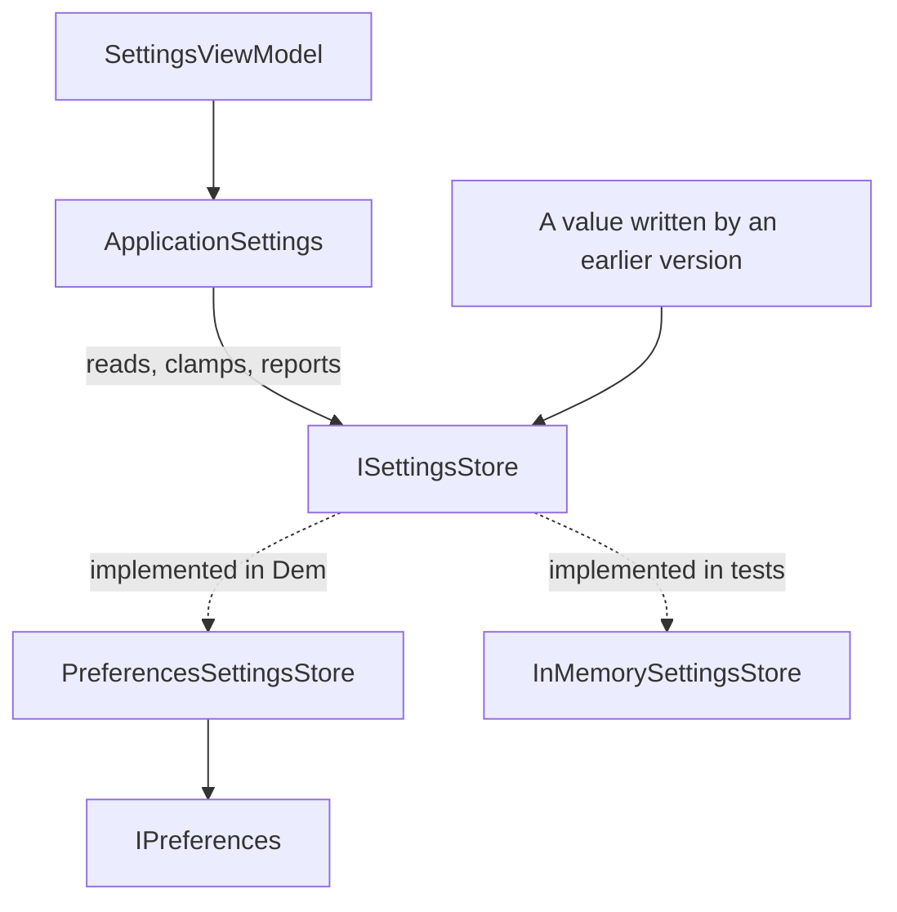

# Application Settings Management

**Application Infrastructure** — Composing and configuring the application itself, independent of any one feature

## Intent

Read and write user preferences in a way that survives the application changing its own rules.

## The problem and context

A settings screen offers four choices: whether notifications are on, how many rows a list shows,
which warehouse is the default, and when the application last synchronised.

Writing them to `Preferences` is a few lines. **The hard part arrives later.**

A device that ran an earlier version holds a page size of **500**, because that version allowed it.
This version allows 10 to 100. That stored value is not corrupt, was not tampered with, and was
legal when it was written — and it is not acceptable now.

**A stored setting is untrusted input from a version of the application that no longer exists.**
That is what makes settings a pattern rather than a wrapper.

## The idiomatic approach

**Check on read, not only on write.** Validation added in this version cannot reach back into what
an earlier version already wrote:

```csharp
public int PageSize
{
    get
    {
        var stored = _store.GetInt(SettingKeys.PageSize, DefaultPageSize);
        var clamped = Math.Clamp(stored, MinimumPageSize, MaximumPageSize);
        PageSizeWasClamped = clamped != stored;
        return clamped;
    }
    ...
}
```

**And say so.** `PageSizeWasClamped` exists so the settings screen can tell the user their stored
choice is no longer available. A value silently changed underneath someone is how a support call
begins.

Throwing was rejected: a settings screen that will not open because an earlier version wrote a
then-legal value is worse than the value being corrected and the correction being reported.

## The seam, and why it is not optional

`AppSettings.Core` declares its own `ISettingsStore`, and `AppSettings.Demo` adapts .NET MAUI's
`IPreferences` to it — about fifteen lines.

**That is not because `.Core` cannot reference MAUI.** It can. `Microsoft.Maui.Essentials` 10.0.100
ships a plain `net10.0` library, and both `IPreferences` and `Preferences` are in it. The reference
compiles. Probed on plain `net10.0`:

```
compiled against Microsoft.Maui.Storage on plain net10.0
threw at run time: Microsoft.Maui.ApplicationModel.NotImplementedInReferenceAssemblyException
message: This functionality is not implemented in the portable version of this assembly.
You should reference the NuGet package from your main application project in order to
reference the platform-specific implementation.
```

**It compiles and it throws, with no compiler warning.** A test that touched `Preferences.Default`
would fail at run time for a reason that looks nothing like its cause.

[Navigation](../Navigation/README.md) needed the same seam for `IQueryAttributable`. The reason is
stronger here, because that one does not compile and this one does.

## Four things the platform does that are easy to get wrong

**Only seven types are storable** — `Boolean`, `Double`, `Int32`, `Single`, `Int64`, `String`,
`DateTime`. Anything else must be serialised, and Microsoft warns that "performance may be impacted
if you store large amounts of text, as the API was designed to store small amounts".

`ISettingsStore` therefore exposes typed members rather than a generic `Get<T>`. No constraint can
express "one of these seven", so a generic method would compile for types the store cannot hold.

**A default cannot report absence.** Microsoft's own reason for `ContainsKey`:

> Even though `Get` has you set a default value when the key doesn't exist, there may be cases where
> the key existed, but the value of the key matched the default value. So you can't rely on the
> default value as an indicator that the key doesn't exist.

So `HasBeenConfigured` uses `ContainsKey`. A user who deliberately chose the default leaves a store
that `Get` cannot distinguish from an untouched one — and "has this person ever been asked?" is a
real question for a first run.

For the same reason, `ResetPageSize` **removes** the key rather than writing the default over it.
Writing the default would leave a key behind and claim a choice nobody made.

**Dates are stored through `ToBinary`, which adjusts non-UTC values.** Microsoft:

> See the documentation of these methods for adjustments that might be made to decoded values when a
> `DateTime` is stored that isn't a Coordinated Universal Time (UTC) value.

The rule this repository derives: **normalise to UTC on the way in, and treat what comes back as
UTC.** [Dependency Injection](../DependencyInjection/README.md) reached the same conclusion from a
different direction — a device's time zone should not change what a timestamp means.

**Uninstalling does not reliably clear settings.**

> Uninstalling the application causes all *preferences* to be removed, except when the app runs on
> Android 6.0 (API level 23) or later, while using the Auto Backup feature. This feature is on by
> default.

So "the user can reset it by reinstalling" is **false on Android by default**, and a fresh install
can meet settings written by a version that was uninstalled months ago. That is the same problem as
the page size, arriving by a route most developers do not expect.

## Architecture and components



**Participants.**

| Participant | Project | Role |
|---|---|---|
| `ISettingsStore`, `SettingKeys` | `AppSettings.Core` | The store contract, and the keys declared once |
| `ApplicationSettings` | `AppSettings.Core` | Typed settings, their defaults, and this version's rules |
| `SettingsViewModel` | `AppSettings.Core` | The screen, which reports a correction once |
| `PreferencesSettingsStore` | `AppSettings.Demo` | The only class that knows `Preferences` exists |

**Dependencies.** `.Core` depends only on `CommunityToolkit.Mvvm`. The store is registered through
the container, as [Dependency Injection](../DependencyInjection/README.md) established:
`ISettingsStore` and `ApplicationSettings` singleton, the screen transient so reopening it re-reads.

## When to apply it

* An application keeps user choices between runs.
* Those choices have rules, and the rules may change between versions.
* A setting must be readable without a platform — in a test, or in shared logic.

## When not to — over-application

**Do not store secrets here.** This entry stores a page size, a warehouse code and a timestamp. .NET
MAUI provides `SecureStorage` for credentials and tokens, and this catalogue covers it under
Security. Nothing in this pattern makes a claim about how `Preferences` protects data at rest — it
simply does not put anything sensitive there.

**Do not store large or structured data.** The API is documented as designed for small amounts of
text, and on Windows a value is capped at 8K. A list, a document or a cache belongs in a file or a
database.

**Do not wrap a store and stop.** A typed facade with no rules is a rename. What earns this entry its
place is what happens when the stored value is no longer one this version would have written.

**Do not validate only on write.** It is the natural instinct and it cannot reach the values that
matter, which were written before the rule existed.

## Production-readiness considerations

**Testability** — proven directly. Every rule is exercised against an in-memory store, with no
platform.

**Version drift** — the case the pattern exists for, and the one a test proves: a page size of 500
from an earlier version is corrected on read and the correction is reported.

**Time** — stored in UTC, returned as UTC, and a test round-trips a local value to prove the instant
survives.

**What was actually verified.** The `NotImplementedInReferenceAssemblyException` above was produced
by running a probe outside this repository. The tests exercise `ApplicationSettings` through an
in-memory store: **what they prove is that `ApplicationSettings` reads back what it wrote and
applies its rules — not that .NET MAUI's `Preferences` holds these types.** The platform store is
exercised by nothing here, and the demonstration compiles for all four platform heads without being
run.

## Trade-offs

**What it buys.** Settings logic that is testable, rules that live in one place, and a stored value
from any past version handled deliberately rather than trusted.

**What it costs.** An adapter per platform store, and a set of typed members that grows if the
settings need more of the seven types. Checking on every read also means the rules run more often
than they strictly need to — which is cheap here and would need thought if a setting were read in a
loop.

## Relationships

Uses **Dependency Injection** for the store and the settings object, and **Model-View-ViewModel** and
**Commanding and Behaviours** for the screen. Related to **Validation**, which also treats incoming
values as untrusted — the difference is the source: Validation guards what a user types now, and
this entry guards what the application itself wrote earlier.

Conceptually the **Adapter** pattern from the Gang of Four catalogue, for the store seam, and the
**Anti-Corruption Layer** from domain-driven design. Described in prose only; this repository holds
no reference to `csharp-project-001-gof-design-patterns`.

## What the tests assert

`AppSettings.Core.Tests` asserts that an empty store gives every setting its documented default;
that each setting reads back what it wrote; that a page size stored above the maximum or below the
minimum is corrected on read **and reported**, while one inside the range is not reported; that a
local time is stored and returned as the same instant in UTC; that writing a setting to its own
default value is still a choice, which only `ContainsKey` can detect; that resetting one setting
removes it rather than writing the default over it; that resetting everything restores every
default; that writing one setting leaves the others untouched; and that the settings screen reports
a correction once and clears the notice after saving.

The clamp was removed and the tests re-run before it was restored. Three of the twelve failed.
