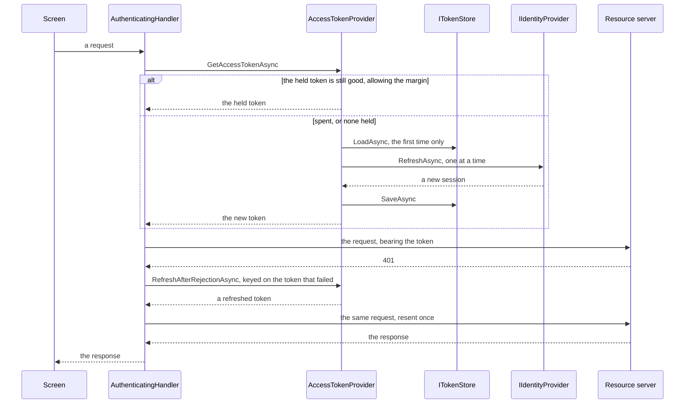

# Authentication

**Security** — Establishing and enforcing who the application is acting for, and what they may do

## Intent

Obtain a credential for the signed-in user, keep it only as long as it is good for, replace it
exactly once when it is not, and attach it to every request without any caller having to think
about it.

## The problem and context

A mobile client calls services that will not answer without proof of who is asking. Obtaining that
proof is the easy part. Everything after it is where applications go wrong:

* The token expires, usually while the application is in somebody's pocket.
* Several screens discover that at the same moment.
* The server rejects a token the client believes is fine.
* The user signs out, and something keeps working that should not.
* The token ends up somewhere it can be read — a log line, a crash report, a settings file.

**This entry is about the lifetime of an access token**, and nothing else. What a user may then *do*
is [Authorization](../../docs/maui-enterprise-pattern-catalogue-v1.0.0.md), a separate entry. The
operational test for the boundary: an implementation that reads claims out of the token has started
that entry's work here.

## Nothing in this entry reaches an identity provider

**There is no authority, no client id, no tenant, no redirect URI and no endpoint anywhere in this
pattern.** `Authentication.Core` performs no I/O at all. The tests implement the provider in memory;
the demonstration fabricates a session on the device.

**Every fixture value announces that it is not a credential.** That is deliberate and it is the more
important half of the rule. A plausible-looking placeholder in a reference implementation is worse
than none, because the failure mode is somebody copying a realistic literal out of it and putting it
somewhere real.

The production answer for a real provider is the **Microsoft Authentication Library**, which handles
the browser-based flow, the platform broker, and token caching against a real authority.
`WebAuthenticator` covers providers MSAL does not. Both are platform types, and MSAL is a package
this repository does not carry. **Named here, used nowhere** — the same treatment
[Accessing Remote Data (REST)](../RemoteData/README.md) gave `IHttpClientFactory`,
[Containerized Service Integration](../ContainerServices/README.md) gave .NET Aspire, and
[Retry](../Retry/README.md) and [Circuit Breaker](../CircuitBreaker/README.md) gave Polly.

## The five things a naive implementation gets wrong

### 1. Every caller refreshes

Five screens issue requests. The token has just expired. Five refreshes go out.

Read as an efficiency note, that is four wasted round trips. It is not an efficiency note. **Where
refresh tokens are rotated on use, and reuse of a rotated token is treated as evidence of theft, the
second and subsequent refreshes present a token the first has already replaced — and a provider that
detects reuse revokes the whole family.** The user is signed out by their own client's storm.

One refresh at a time, and **the callers behind it take what the first one obtained**:

```csharp
await _gate.WaitAsync(cancellationToken);
try
{
    var session = await CurrentSessionAsync(cancellationToken);

    // The re-check. A gate that only serialises still performs every refresh, one after
    // another politely.
    if (session is not null && session.AccessToken.IsUsableAt(clock.UtcNow, policy.RefreshSkew))
    {
        return session.AccessToken;
    }
    ...
}
finally
{
    _gate.Release();
}
```

`SemaphoreSlim` rather than `lock`, because **a lock cannot be held across an `await`** and the
refresh is an await. The release is in a `finally`, so a cancelled or refused refresh does not leave
the gate held — which would block every later call for the life of the process while the application
reported nothing wrong.

**The test counts refreshes, not callers.** Five callers each receiving a token proves nothing: an
unguarded implementation does that too, having refreshed five times on the way.

### 2. Checking expiry is treated as the answer

It is not the answer. It is an optimisation.

| Mechanism | What it is |
|---|---|
| Refresh before expiry, with a margin | An **optimisation**. It avoids a round trip that would certainly fail |
| Refresh after the server refuses the token | The **correctness guarantee**. The server is the authority, and it can refuse for reasons no clock predicts: a revocation, a password change, a policy change |

**A request already in flight when the token expires cannot be recalled.** That case is not
prevented. It is handled, by the second mechanism. An implementation with only the first is wrong
and looks correct in every test where the clocks agree.

The margin exists because the client's clock is not the server's clock and a request takes time to
arrive. The boundary is **exclusive** — a token is used only while `now + skew` is still before its
expiry — and it is tested one tick either side, because "before expiry" without saying whether the
boundary counts is how off-by-one gets in.

### 3. The resend loses the request, or never stops

Recovering from a `401` is three steps, and each has a way of going wrong.

**Refresh keyed on the token that failed.** Two requests refused on the same token must cause one
refresh between them. The second asks, finds the current token is no longer the one it failed with,
and takes it.

**Clone the request.** An `HttpRequestMessage` **cannot be sent twice** — the second send throws
`InvalidOperationException`. And the body is the part a careless clone loses, which is a defect
nobody sees until a `POST`. The content is buffered **before the first send**, because the first
send consumes the stream:

```csharp
// Before the first send. ByteArrayContent can be read as often as the resend needs;
// a StreamContent cannot be read twice.
await BufferContentAsync(request, cancellationToken);
```

**Resend once.** A `401` on the resend is returned as it stands. The token it carried was minted
seconds earlier, so a second refusal is the server declining the identity rather than the credential,
and asking again is a loop that ends when something else gives out.

### 4. The session is discarded in halves

A session ends three ways: a sign-out, a refusal reached through expiry, and a refusal reached
through the server rejecting a token. **All three go through one operation that clears memory and
storage together**, because the alternative is a call site that remembers one half.

The half that gets forgotten is the memory, and the path where it matters is the third one:

| Path | The cached token when the refusal happens |
|---|---|
| Expiry | **Already spent.** Clearing only the store is survivable — the token fails its own check |
| Server rejection | **Not expired.** The clock says it is fine and the server has refused it |

On the second path, clearing only the store leaves a token that **passes every check the client can
make** and that the resource server will not accept. The next acquisition hands it out. And the next.
The store is empty, so the state looks clean, and the application keeps presenting a dead credential
until it is next launched.

It is the same shape as a sign-out that clears storage and keeps the in-memory copy — which looks
like it worked and did not — arriving without anybody having asked to sign out.

### 5. The token prints itself

A positional `record` generates a `ToString()` that prints every property. So this

```csharp
public sealed record AccessToken(string Value, DateTimeOffset ExpiresAt);
```

turns `$"acquired {token}"` into a credential disclosure, in a log line, an exception message or a
crash report. **Nobody writes `Console.WriteLine(token.Value)`. A great many people write the
interpolation, and it does the same thing.**

**A type that carries a credential is responsible for its own redaction**, because it cannot rely on
every caller remembering. Both `AccessToken` and `AuthenticationSession` override `ToString()`, both
are tested for it, and the demonstration's screen prints the token *object* — which is the point.

## Where a token is kept, and where it is not

`Preferences` is for settings. **`SecureStorage` is for credentials**, and it is backed by the
platform's own key store. The
[Application Settings Management](../AppSettings/README.md) entry fenced secrets out by name and
pointed here; this is the other side of that fence.

`Authentication.Core` can reference neither — both are `Microsoft.Maui.Storage` types and this
project targets plain `net10.0` — so `ITokenStore` is declared in `.Core` and adapted in `.Demo`,
which is the seam shape every entry in this repository uses.

Two things the adapter does deliberately:

* **Three keys rather than one serialised blob.** It keeps a serialiser off a security-sensitive
  path.
* **`Remove`, never `RemoveAll`.** `SecureStorage.RemoveAll()` clears every secret the application
  has stored, not only this session's. A sign-out that throws away another feature's data is a
  defect that gets reported as something else entirely.

And one rule carried over unchanged: **what came out of storage was written by a version of this
application that no longer exists.** A partial or unparsable store is treated as no session at all.

## Architecture and components



**Participants.**

| Participant | Project | Role |
|---|---|---|
| `AccessTokenProvider` | `Authentication.Core` | The session, the single refresh, and the one way a session ends |
| `AuthenticatingHandler` | `Authentication.Core` | Attaches the token, and recovers once from a rejection |
| `AccessToken` | `Authentication.Core` | The credential, its expiry, and its own redaction |
| `AuthenticationSession` | `Authentication.Core` | The pair that is held and discarded together |
| `AuthenticationPolicy` | `Authentication.Core` | The margin before expiry |
| `IIdentityProvider` | `Authentication.Core` | The seam where a real provider would be |
| `ITokenStore` | `Authentication.Core` | The seam where `SecureStorage` is adapted |
| `IClock` | `Authentication.Core` | Injected, so no test waits |
| `SessionViewModel` | `Authentication.Core` | Sign in, use, sign out, and a status that never shows a token |
| `SecureStorageTokenStore` | `Authentication.Demo` | `ISecureStorage`, three keys, `Remove` not `RemoveAll` |
| `StandInIdentityProvider` | `Authentication.Demo` | Fabricates a session locally, with a switch that makes it refuse |

**Dependencies.** `.Core` depends only on `CommunityToolkit.Mvvm`. `AuthenticatingHandler` lives
there because `System.Net.Http` is in the shared framework. **This pattern adds no package.**

**Thread safety, and the contrast with Circuit Breaker.** `AccessTokenProvider` **is** thread-safe;
`ServiceCircuitBreaker` deliberately is not, and says so. That is not an inconsistency. A breaker in
this repository is driven from a screen, on one UI thread. A token is fetched inside an HTTP message
handler, which runs on whatever thread the HTTP stack gives it.

The cached session is a `volatile` field, and the reason is narrower than it looks. **Staleness is
harmless** — a caller that reads the previous session takes the gate, re-checks, and finds the
current one. **Visibility is not**: ECMA-335 does not promise that an ordinary write becomes visible
to a thread that never takes the gate, and the fast path is exactly that thread. This is about what
is *guaranteed*, not about anything observed to fail here; nothing in this repository has observed
it, and the barrier costs nothing measurable.

## When to apply it

* The application calls a service that will not answer without a credential.
* That credential expires, and can be renewed without asking the user again.
* More than one screen makes such calls.

## When not to — over-application

**Do not give each screen its own token provider.** Each would hold a session, each would refresh
separately, and the single-refresh rule would be defeated by composition. One per application.

**Do not put the token in `Preferences`, or a log, or a URL.** A query string reaches server access
logs, proxy logs and browser history.

**Do not parse the access token.** It is opaque to the client. The expiry is what the provider said
when it issued it, not a field extracted from it; a client that reads claims for its own decisions
has moved into the next entry's territory and has done so without a trustworthy source.

**Do not treat every failure as an authentication failure.** A `500` says the service is unwell and
nothing about the credential. Refreshing on it burns a refresh token on every outage.

**Do not retry a refused refresh.** A refusal is the end of the session, not a transient fault. It
is one of the exceptions [Retry](../Retry/README.md) names as not retryable, for exactly this reason.

**Do not write this at all if a library will do it.** MSAL exists, is maintained by the people who
run the provider, and handles brokers, conditional access and platform key stores. This entry exists
to show what it is doing, not to suggest replacing it.

## Production-readiness considerations

**Testability** — proven directly. The clock is injected and no test waits on real time. The
concurrency test holds a refresh open with a `TaskCompletionSource` and relies on the fact that an
async method runs synchronously as far as its first `await`, so the queued callers are queued by
construction rather than by timing.

**What a caller of `HttpClient` observes, measured rather than assumed.** When the refresh is
refused inside the handler, `AuthenticationRequiredException` reaches the caller of
`HttpClient.SendAsync` **as itself, not wrapped**. That was measured by a test that asserts the
identity of the exception object, on .NET 10, because a `catch` clause documented in a reference
implementation that does not actually catch would be worse than saying nothing.

```csharp
try
{
    using var response = await client.GetAsync(uri, cancellationToken);
}
catch (AuthenticationRequiredException)
{
    // Send the user to sign in. This is the end of the session, not a fault to retry.
}
```

**Security.** No network is reached and no secret exists outside a test fixture, where every value
says so. Credential-bearing types redact themselves and are tested for it. The demonstration's
screen prints the token object rather than its value, and the XAML says why beside the binding.

**Observability.** `IsSignedIn` and the view model's status are readable. Nothing that can be read
carries a token.

**What was actually verified.** All behaviour is exercised in `Authentication.Core` against an
in-memory provider and store, with an injected clock. The handler is tested through a real
`HttpClient` with only the socket replaced; the address used is in the reserved `.invalid`
top-level domain and nothing is sent to it. The demonstration compiles for all four platform heads
and has not been run on a device, so **`SecureStorage` itself is unexercised** — that adapter is
shown, not proven.

## Trade-offs

**What it buys.** Callers stop thinking about credentials. A token is renewed before it fails, and
recovered from when it fails anyway. An expiry storm costs one refresh instead of one per caller.
A signed-out user is signed out everywhere at once.

**What it costs.** Shared mutable state, and therefore a lifetime decision and real synchronisation.
A margin, a retry rule and a storage decision are three more parameters that can be set badly. And
the pattern can be **wrong**: a token refreshed early is a round trip that need not have happened,
and a resend after a `401` doubles a request the server may already have acted on — which is why the
resend is once, and why an operation that is not safe to repeat should say so in its own name, as
`ExecuteIdempotentAsync` does in [Retry](../Retry/README.md).

## Relationships

Uses **Dependency Injection** for the clock, the store, the provider and the single shared
`AccessTokenProvider`, and **Model-View-ViewModel** for the screen. Stores through the seam
**Application Settings Management** deliberately left empty, and for the reason that entry gave.
Wraps the kind of call **Accessing Remote Data (REST)** makes, as another `DelegatingHandler` in the
same pipeline.

**Retry** named this entry directly: its README says a `401` is retryable *after refreshing a token*,
and that this is authentication's business. **This is where that is made good** — and the recovery
lives in the message handler rather than in a retry policy, because it is one specific recovery from
one specific status rather than a schedule. **Circuit Breaker** supplies the contrast for thread
safety above.

**Authorization** is the next entry and the other half of this category: this one establishes who the
user is and stops there.

Conceptually a **Proxy** in the Gang of Four sense — the handler stands in front of the real call and
adds something to it — and the **Federated Identity** and **Valet Key** patterns from the cloud
design patterns catalogue are its neighbours. Described in prose only; this repository holds no
reference to `csharp-project-001-gof-design-patterns` or `csharp-project-002-cloud-design-patterns`.

## What the tests assert

`Authentication.Core.Tests` asserts that a held token is returned without the provider being called;
that a stored session is loaded rather than a sign-in demanded, and the store is consulted once
rather than on every acquisition; that an expired token is refreshed and the new session stored;
that a token **inside the margin** is refreshed although it has not expired; that **at exactly the
margin** it is refreshed and one tick later it is not; that with no session anywhere a sign-in is
demanded; that a refused sign-in leaves nothing behind and does not wedge the gate; that a refused
refresh **clears the store**; that a refusal reached through a server rejection **also discards the
token still in memory**, proven by the next acquisition demanding a sign-in rather than by the store
being empty; that sign-out clears both halves; that **five concurrent callers cause exactly one
refresh**; that two requests refused on the same token cause one refresh between them; that a
cancelled refresh neither discards the session nor wedges the gate; and that a store which failed
once is asked again.

For the handler: that every request carries the bearer token; that a non-`401` failure passes
through with no refresh; that a `401` causes **exactly one refresh and exactly one resend**, with a
different token on the second attempt; that a `401` on the resend is returned as it stands; that a
resent request **keeps its body and its headers**; and what the caller of `HttpClient` actually
receives when the refresh is refused.

Neither credential-bearing type prints its secret, and neither does the screen.

**Two faults were planted, because there are two independent safeguards.** Replacing the gate with
one that excludes nothing — leaving the re-check in place — failed **exactly one** test, the
concurrency test, and nothing else. Removing the re-check while keeping the gate failed **eleven**,
because that check is on the ordinary acquisition path as well as the contended one. Both were
reverted and the revert was confirmed byte-identical.
