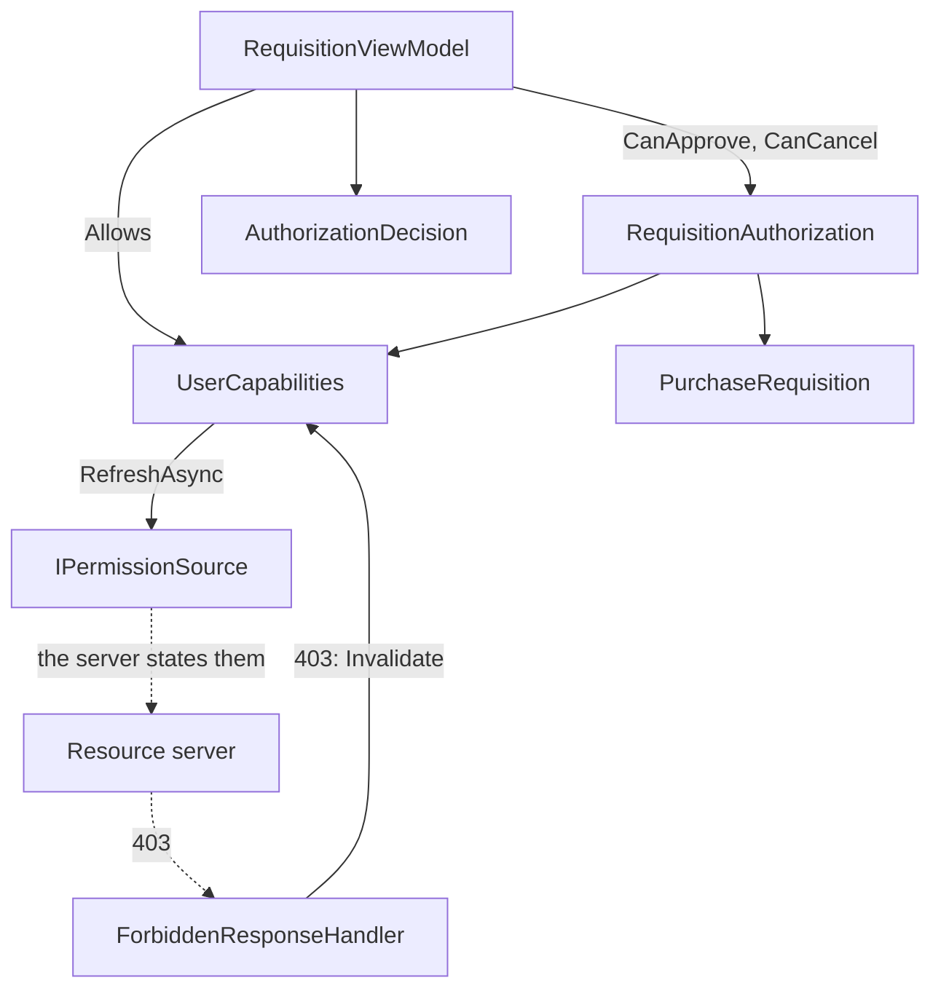

# Authorization

**Security** — Establishing and enforcing who the application is acting for, and what they may do

## Intent

Decide what a screen should offer this user for this record, and explain every refusal — without
ever pretending that the decision is the one that matters.

## Read this before the rest

**A mobile client cannot enforce authorisation.** The binary is on the user's device. It can be
patched, hooked, run on a device the user controls completely, or bypassed altogether by calling the
API directly with any HTTP tool. **Every authorisation decision that matters is made by the server.**

What this entry builds does something else, and something worth doing: it **shapes the user
interface**. It does not offer what it believes the user cannot have, and it says why. That is a
usability and honesty feature.

**Nothing here is a security control.** An entry that blurred that would teach a defect to every
reader, so the distinction is stated here, restated in the code, and printed on the demonstration's
own screen.

The server-side half — the one that actually decides — is described in this file and is **not built**,
because this repository holds no server.

## The problem and context

An application has screens full of controls. Some users may use some of them. The naive approaches
both fail:

* **Offer everything and let the server refuse.** Every user meets errors they could have been
  spared, and an "Approve" button that always fails is worse than no button.
* **Decide in the client and trust the decision.** Now the client is the security boundary, and the
  client is on somebody else's phone.

The useful position is between them: **the client makes the same decision the server will make, for
the interface's sake, and the server makes it again for real.**

## Where the permissions come from

**The server states them**, over the authenticated channel, as ordinary data: the subject they belong
to, and the names granted. The party that enforces a rule is the only honest source for what the rule
says.

Three sources were rejected, and the reasons are worth keeping:

| Rejected | Why |
|---|---|
| **The access token's claims** | A client cannot validate a token usefully, and parsing one needs a package. The [Authentication](../Authentication/README.md) entry treats the token as **opaque** and this entry does not undo that |
| **A table compiled into the client** | The client would be deciding its own permissions, which is the defect this entry exists to warn about |
| **Trying the operation to find out** | That is a side effect, not a question |

**The subject comes from the same response.** The client is told who it is acting for; it does not
work it out. That is what keeps the boundary with the previous entry intact from this side.

## A permission name is a string, and an unknown one is denied

Not an enumeration. A server can grant a name this build has never heard of, and an enumeration makes
that either impossible or a parse failure.

* Comparison is **ordinal**, and therefore case-sensitive. Two systems whose permission names differ
  only in case are two systems, and matching them loosely is how one system's permission silently
  becomes another's.
* **An unknown name is denied.** The set answers only about what it was told.
* The same rule reaches further than permissions: a requisition in a **state this build does not
  recognise** — because the server added one — is not a state this client can act in.

## Three kinds of not knowing, and three different answers

This is the decision the entry turns on, and it is where the security instinct is wrong.

**"Fail closed" is the right rule where a check is the thing that stops an action.** This one is not:
the server stops it. So denying everything because a refresh failed buys **no security at all**, and
costs the user every affordance in the application because their train went into a tunnel.

| What the client holds | What it does | Is this "fail closed"? |
|---|---|---|
| **Nothing, ever** — no successful load | **Denies everything** | Yes. Offering a capability nobody has described is guessing |
| **A set it could not refresh** | **Keeps it, and says it is stale** | No, deliberately. It is the last thing the server actually said |
| **A set the server has contradicted** — a `403` | **Discards it** | Not applicable. This is not absence of evidence |

**Absence of evidence and contrary evidence are different inputs, and must not produce the same
output.** Collapse them and you get either an application that locks users out on a flaky
connection, or one that keeps offering what the server has just refused.

**`Allows` is synchronous**, and that is not laziness. An asynchronous check would put a network call
behind every button's enabled state — and behind every one of them at once, while the network is
down.

## The race that undoes the correction

Two behaviours above are each correct alone and lose together:

```
refresh starts ──────────────────────────────────► answer arrives (pre-revocation)
                    403 arrives, set discarded ─┘
```

The refresh completes carrying the permissions **as they were before the revocation** and installs
them. The application now believes exactly what the server refused, the `403` handler's work has been
undone by a slower call that started earlier, and **nothing corrects it** — if the interface is driven
by those permissions, no further refresh may ever be triggered.

**A generation counter fixes it.** Discarding the set increments it; a refresh captures it before
asking and installs its answer **only if it has not moved**:

```csharp
// A late answer to a question that is no longer being asked is dropped, not applied.
if (Volatile.Read(ref _generation) != generation)
{
    return RefreshOutcome.Superseded;
}
```

The caller is told, and asks the user to press refresh again. **It is not retried automatically**: a
server that is actively revoking could supersede every attempt, and a silent loop is worse than a
sentence.

## A permission is not a decision

"May approve requisitions" is a permission. "May approve **this** requisition" needs the requisition.
**Checking the permission and stopping there is the most common real authorisation defect**, and
self-approval is its most common form.

Approval is refused in this order, and **the order is user-visible**:

| # | Condition | Why it is here and not lower |
|--:|---|---|
| 1 | The permission | The coarsest fact. Every other reason is only meaningful to somebody who has it |
| 2 | Not your own requisition | A relationship, not a threshold. Saying "above your limit" instead would imply a bigger limit helps |
| 3 | Within your limit | |
| 4 | In a state where approval means something | |

Telling a user with no approval role that something is "above your limit" is **wrong**, invites them
to ask for a limit that would change nothing, and **discloses the limit** to somebody with no role at
all.

**And a permission is not the only thing that grants.** The person who raised a requisition may cancel
it with no permission whatsoever — a permission table would never say so. Authorisation is a
relationship between a subject and a resource.

## `401` and `403` are not the same news

| Status | What it means | Whose business |
|---|---|---|
| **401** | *Who you are* is not accepted | [Authentication](../Authentication/README.md) — refresh the token, resend once |
| **403** | Who you are is accepted; *what you asked for* is not | **This entry** — the client's idea of its permissions is wrong |

**A `403` is never retried.** The same request with the same identity will be refused again, and
asking twice is a loop with a slower answer. It is one of the statuses [Retry](../Retry/README.md)
already names as not retryable.

**The whole set is discarded, not the permission that seems to be involved.** A `403` carries a
status, not a permission name. Invalidating selectively would need a map from route to permission —
and **that map is the client deciding its own permissions**, which is the rejected design in another
form. It would be written once and be wrong, silently, the first time the server changed a route.

**And a `403` is a signal, not routine traffic.** In a client that shapes its own interface, a user
should not be able to press a button that produces one. When one arrives it is exactly one of three
things:

1. the permission set was stale — handled;
2. **a screen offered something it should not have** — a defect in this entry's own checks;
3. **a request went out with no check in front of it** — a defect too.

Two of the three are bugs in the client, so the handler **counts them** instead of quietly correcting
the display. In a correct client the count stays at zero.

## Architecture and components



**Participants.**

| Participant | Project | Role |
|---|---|---|
| `UserCapabilities` | `Authorization.Core` | The held set, the three kinds of not knowing, and the generation counter |
| `PermissionSet` | `Authorization.Core` | Immutable: the subject and the names granted |
| `RequisitionAuthorization` | `Authorization.Core` | The decision, which needs the resource |
| `AuthorizationDecision` | `Authorization.Core` | Allowed or not, a reason **code**, and a sentence |
| `ForbiddenResponseHandler` | `Authorization.Core` | Notices a `403`, discards, counts, never retries |
| `IPermissionSource` | `Authorization.Core` | The seam where the server is |
| `RequisitionViewModel` | `Authorization.Core` | Disables and explains |
| `StandInPermissionSource` | `Authorization.Demo` | Answers locally, with switches for every case |

**Dependencies.** `.Core` depends only on `CommunityToolkit.Mvvm`. **This pattern adds no package**,
and it deliberately does not reference `Authentication.Core` — the composition is described here and
implemented by neither.

**A decision carries a code as well as a sentence.** The sentence is for the user. The code is so a
test can assert *which* refusal happened: an assertion on wording freezes prose this entry positively
invites improving, and the obvious repair — asserting only that the decision was a refusal — passes
for **every** refusal and proves nothing about the order.

**Thread-safe without a lock, and the reason is worth reading rather than copying.** The held set is
**immutable and replaced wholesale**, so there is no read-modify-write to protect and a `volatile`
reference is enough on a hot path that runs for every button. The Authentication entry needed a
semaphore because it had to decide whether to refresh and then refresh; this one only ever publishes
a new value.

## When to apply it

* Screens offer operations that not every user may perform.
* The set of who-may-do-what lives on the server and can change while the application is running.
* A refused operation is worth explaining rather than discovering.

## When not to — over-application

**Do not treat any of this as enforcement.** It is the whole of the first section and it is the only
thing in this file that cannot be traded away.

**Do not give each screen its own `UserCapabilities`.** Each would hold its own idea of what the user
may do, and a `403` would correct one of them.

**Do not read claims out of the access token to get here faster.** The client cannot validate it, and
a client that decides what it may do from a document it cannot verify has invented its own
permissions.

**Do not hide every refused control by reflex.** A hidden control is invisible and a user who was
told they could do something will believe the application is broken. Explaining is the better default
for an internal line-of-business screen — **and an explanation discloses that the capability exists**,
which is the wrong trade where the existence of an operation is itself sensitive. That is the choice
to make deliberately, per screen.

**Do not build a role hierarchy here.** Inheritance between roles is a server concern; the client
receives the result.

## Production-readiness considerations

**Testability** — proven directly. `Authorization.Core` performs no I/O and every test is
deterministic. The race in the section above is tested by interleaving the discard **inside** the
load, so the ordering is by construction rather than by timing, and **no threads are raced**.

**Observability** — the entry's own answer to "how would you know?". `ForbiddenResponses` and
`LastForbiddenPath` are readable and the demonstration shows them, because two of the three causes of
a `403` are defects in the client and a silent correction hides both.

**Security** — nothing here handles a credential, which removes the hazard rather than managing it.
No network is reached. The one security claim this entry makes is the one at the top, and it is a
claim about what the entry is **not**.

**What was actually verified.** All behaviour is exercised in `Authorization.Core` against an
in-memory permission source. The handler is tested through a real `HttpClient` with only the socket
replaced; the address used is in the reserved `.invalid` top-level domain and nothing is sent to it.
The demonstration compiles for all four platform heads and **has not been run on a device**.

**A name that is unambiguous here can be ambiguous in the platform head.** `Permissions` in this
entry means what the server lets the user do. `Microsoft.Maui.ApplicationModel.Permissions`, which
MAUI's implicit usings supply, means what the operating system lets the application do — the camera,
the location. `Authorization.Core` never sees the collision because it never references MAUI; the
head does, and disambiguates with an alias rather than either side renaming.

## Trade-offs

**What it buys.** Users are not offered operations that will fail, and are told why when something is
refused. One place decides, so two screens cannot disagree. A server that changes its mind is noticed.

**What it costs.** A second implementation of rules the server already has, which can drift from them
— and when it drifts, the symptom is a `403`, which is why they are counted. Shared mutable state,
and therefore a lifetime decision. And a refusal explained is a capability disclosed, which is a real
cost on some screens and none on others.

**And it can be wrong in the safe direction or the annoying one.** Holding a stale set offers
something the server will refuse; discarding too eagerly hides something the user may have. The
three-way rule above is the attempt to be wrong in the cheaper direction each time.

## Relationships

**Authentication** is the other half of this category and comes first: it establishes **who** the user
is, and this entry decides **what they may do**. The `401`/`403` table above is the seam between them,
and it is described rather than built — the pattern projects here do not reference one another.

Uses **Dependency Injection** for the single shared `UserCapabilities`, and **Model-View-ViewModel**
for the screen. Sits in the same pipeline as **Accessing Remote Data (REST)** as another
`DelegatingHandler`. Makes good on a claim **Retry** makes about which statuses are not retryable.

Conceptually a **Guard** and a **Specification** in the wider pattern literature, and the **Gatekeeper**
and **Federated Identity** patterns from the cloud design patterns catalogue are its neighbours —
though Gatekeeper is a server-side pattern, which is the point this entry keeps making. Described in
prose only; this repository holds no reference to `csharp-project-001-gof-design-patterns` or
`csharp-project-002-cloud-design-patterns`.

## What the tests assert

`Authorization.Core.Tests` asserts that a granted name is allowed and an **unknown one is denied**;
that the empty set grants nothing and its subject is `null` rather than empty, so it can never equal
a record's owner; that a name differing only in case is denied; that **before anything has loaded,
nothing is allowed**; that a successful refresh grants what the server said; that **a failed refresh
keeps what is held and reports it stale**; that a failed *first* load leaves everything denied; that
a later success clears the stale mark; that **discarding is not reported as staleness**; that **a
refresh in flight when the set was discarded does not reinstate it**; that the next refresh after a
discard installs normally; and that a cancellation is not treated as a failure.

For the decision: that the permission is required; that **a requisition the subject raised is refused
even with the permission**; that the limit is inclusive at the boundary and refused above it; that a
state this build does not recognise is refused; that **a subject failing three conditions at once is
told about the permission**; that with the permission, their own requisition is reported before the
limit; that **the raiser may cancel with no permission at all**; that somebody else may not, even
with every permission; and that the raiser may not cancel one already approved.

For the handler: that a `403` discards the set, is returned unchanged, is sent **exactly once**, and
is **recorded**; that a success changes nothing; and that a **`401` does not discard the set**.

For the screen: what it offers and what it explains, what it says when the server cannot be reached,
and what it says when the set was discarded mid-refresh.

**Three faults were planted, each aimed at one mechanism.** Removing the self-approval check failed
**three** tests, all of them about self-approval. Removing the generation check failed **two**, both
about the late refresh. Checking the limit before the permission failed **two**, both order tests.
Each was reverted and each revert was confirmed byte-identical.
