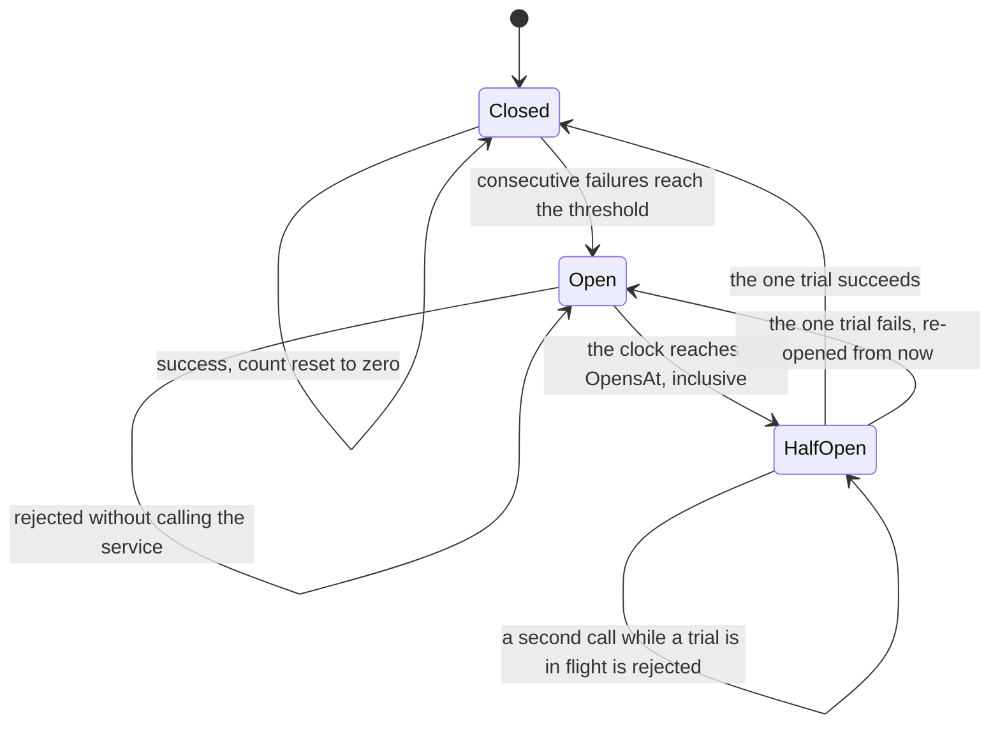

# Circuit Breaker

**Resilience & Connectivity** — Surviving the failures a networked mobile client actually experiences

## Intent

Stop calling a service that is failing, and find out when it has recovered without asking it
constantly.

## The problem and context

A service goes down. Every screen that needs it keeps calling, every call waits for a timeout, and
every user watches a spinner for the full duration before being told something went wrong.

Meanwhile the service — which may be overloaded rather than dead — receives the full traffic of every
client that has not yet given up, which is exactly what stops it recovering.

**The fix is to stop asking for a while**, and that requires remembering across calls. That memory is
what makes this a different pattern from [Retry](../Retry/README.md), which tries again *within* one
logical call and remembers nothing.

## Three states

| State | Behaviour |
|---|---|
| **Closed** | Calls pass. **Consecutive** failures are counted |
| **Open** | Calls are rejected **without being attempted**, until a stated moment |
| **Half-open** | **One call at a time** is admitted as a trial. It closes the breaker or re-opens it |

**Consecutive, not total.** A success resets the count. A breaker counting total failures opens
eventually on any service that has ever failed, however healthy it is now, and the threshold stops
meaning anything.

## The three things a naive breaker gets wrong

**1. Half-open lets everything through.** The obvious code checks "has the open period passed?" and
admits whatever arrives — so a service that has just come back receives everything that queued while
the breaker was open. That is the stampede the breaker exists to prevent, delivered at the worst
possible moment. One trial **at a time**, and a test holds the trial open to prove a second call is
rejected.

**2. The trial flag is not cleared on every path.** Set it when a trial starts, clear it on success
or failure — and a **cancelled** trial goes down neither path, nor does one that fails with an
exception the policy does not count. The flag stays set, the breaker refuses every call for the rest
of the process, and reports itself half-open the whole time.

**That is worse than the outage it was protecting against**, and it will not reproduce in a short
test. The flag is cleared in a `finally`, and two tests cover the paths that would otherwise leave it
set.

**3. Everything counts as a failure.** A 400 means the request was wrong, not that the service is
unwell. A breaker that counts it will open because one screen is sending a malformed request, and
take a working feature down for every other screen. The classification is a parameter — the same
decision, in the same shape, as [Retry](../Retry/README.md)'s retryable predicate.

## Composing with Retry, and what each wrong arrangement costs

**Retry on the outside, breaker on the inside**, and **the retry must decline to retry
`CircuitOpenException`.**

```csharp
// The predicate Retry already accepts. Nothing in Retry.Core changes.
failure => failure is not CircuitOpenException && IsTransient(failure);
```

| Arrangement | What you actually observe |
|---|---|
| **Retry outside, declining the rejection** — correct | Transient failures are retried; once the breaker opens, calls fail instantly and the user is told when to come back |
| **Retry outside, *not* declining it** | Once open, every call still runs its **full retry schedule** against a breaker refusing instantly. The user waits out the entire backoff to be told no, repeatedly |
| **Breaker outside** | Three retried attempts arrive as **one** failure, so a breaker with a threshold of five needs **fifteen** real failures to open. It opens far later than its configuration suggests |

Microsoft's guidance for the pair says the same: a retry policy "should be sensitive to the
exceptions returned by the circuit breaker, and abandon retry attempts if the circuit breaker
indicates that a fault is not transient".

**This is described, not built.** The pattern projects in this repository do not reference one
another, so what ships here is the minimum that makes the composition possible: a distinct
`CircuitOpenException`, carrying `RetryAfter` so a caller can say something better than "it failed".

## Architecture and components



**Participants.**

| Participant | Project | Role |
|---|---|---|
| `ServiceCircuitBreaker` | `CircuitBreaker.Core` | The three states, and the state that survives a call |
| `CircuitBreakerPolicy` | `CircuitBreaker.Core` | Threshold and open duration |
| `CircuitOpenException` | `CircuitBreaker.Core` | The rejection a retry must decline, carrying `RetryAfter` |
| `IClock` | `CircuitBreaker.Core` | Injected, so no test waits |
| `ServiceHealthViewModel` | `CircuitBreaker.Core` | Shows the state, the count and the next attempt |
| `FailingService` | `CircuitBreaker.Demo` | A stand-in with a switch, so a reader can drive all three states |

**Dependencies.** `.Core` depends only on `CommunityToolkit.Mvvm`, and **deliberately not on
`Retry.Core`**. This pattern adds no package.

**Time comes from a clock, not a delay.** "Has enough time passed to try again" is a question about
the clock. The breaker stores **when the open period ends**, not when it began — the two are not
equivalent under a clock a test moves, and the boundary is **inclusive**: at exactly that moment a
trial is admitted.

## When to apply it

* A dependency can fail for long enough that continuing to call it is pointless.
* Calls to it are expensive — a timeout the user waits out, or load the service cannot take.
* There are several callers, and they should share one opinion about whether it is healthy.

## When not to — over-application

**Do not put one on a local, fast, in-process call.** The breaker's cost is the state and the
reasoning; the benefit is avoiding an expensive call that will fail.

**Do not give every caller its own breaker.** A breaker is shared state by definition. One per
caller means each holds a private opinion about the service, and none of them opens in time.

**Do not count every exception.** See above: a breaker opened by malformed requests is a
self-inflicted outage.

**Do not set the open duration by feel.** Too short and it flaps; too long and a recovered service is
ignored. It is a real parameter with a real consequence.

**Do not use it instead of a timeout.** A breaker stops calls to a service known to be failing; it
does nothing about the first slow call. Those are complementary, and a timeout is what limits that
one.

## Production-readiness considerations

**Testability** — proven directly. The clock is injected and every test advances it, so **no test
waits on real time**, including the boundary tests.

**The wedge case is tested, not merely avoided.** A trial that is cancelled, and a trial that fails
with an uncounted exception, each have a test asserting the breaker still admits a later call.

**Concurrency.** The single-trial rule is what protects a recovering service, and it is tested by
holding a trial open with a `TaskCompletionSource` rather than by racing threads. **The
implementation here is not thread-safe**: the counter and flag are plain fields, which suits a MAUI
client where calls originate on one UI thread. A breaker shared across genuinely concurrent callers
needs interlocked access or a lock, and that is a deliberate limit rather than an oversight.

**Observability.** `State`, `ConsecutiveFailures` and `OpensAt` are readable, and the demonstration
shows them, because a fast failure is otherwise indistinguishable from a broken service.

**What was actually verified.** All behaviour is exercised in `CircuitBreaker.Core` with an injected
clock. **No network is reached**; the demonstration's service is a stand-in with a switch. It
compiles for all four platform heads and has not been run on a device.

## Trade-offs

**What it buys.** A failing dependency stops costing every caller a timeout, and stops receiving load
that prevents it recovering. Users get a fast, honest answer with a time attached.

**What it costs.** State, which means a shared instance and a lifetime decision. A breaker can also
be **wrong**: it will refuse calls to a service that recovered a second after it opened, until the
duration elapses. And its parameters — threshold, duration, what counts — are three more things that
can be set badly.

## Relationships

Directly after **Retry**, whose approval recorded holding no state as its fence — **this entry is
where that state arrives**. Uses **Dependency Injection** for the clock and the shared breaker, and
**Model-View-ViewModel** for the screen. Protects the kind of call **Accessing Remote Data (REST)**
makes.

Its neighbours in a resilience pipeline — **timeout**, **bulkhead isolation** and **hedging** — are
real and are not built here. Polly provides all of them, composes them, and is the production answer;
it is a package this repository does not carry.

Conceptually the **Circuit Breaker** pattern from the cloud design patterns catalogue, and a **State**
machine in the Gang of Four sense. Described in prose only; this repository holds no reference to
`csharp-project-001-gof-design-patterns` or `csharp-project-002-cloud-design-patterns`.

## What the tests assert

`CircuitBreaker.Core.Tests` asserts that a closed breaker passes calls through; that failures below
the threshold leave it closed; that **a success resets the consecutive count**; that reaching the
threshold opens it; that an open breaker **rejects without entering the operation**; that
`CircuitOpenException` carries the next attempt time; that **at exactly the boundary** a trial is
admitted and one tick before it is not; that a successful trial closes it and a failed one re-opens
it **from now**; that **a second call while a trial is in flight is rejected**; that an uncounted
failure never opens it; that a cancellation is not a failure; and that neither a cancelled trial nor
an uncounted trial failure can **wedge the breaker shut**.

`ServiceHealthViewModel` is tested for a success, a failure, an open circuit reporting that nothing
was called, and a recovery closing it again.

The success path was changed so it no longer reset the count — making the breaker count total
failures rather than consecutive ones. **Five of thirteen tests failed**, including
`ASuccessResetsTheConsecutiveCount`, and it was restored.
