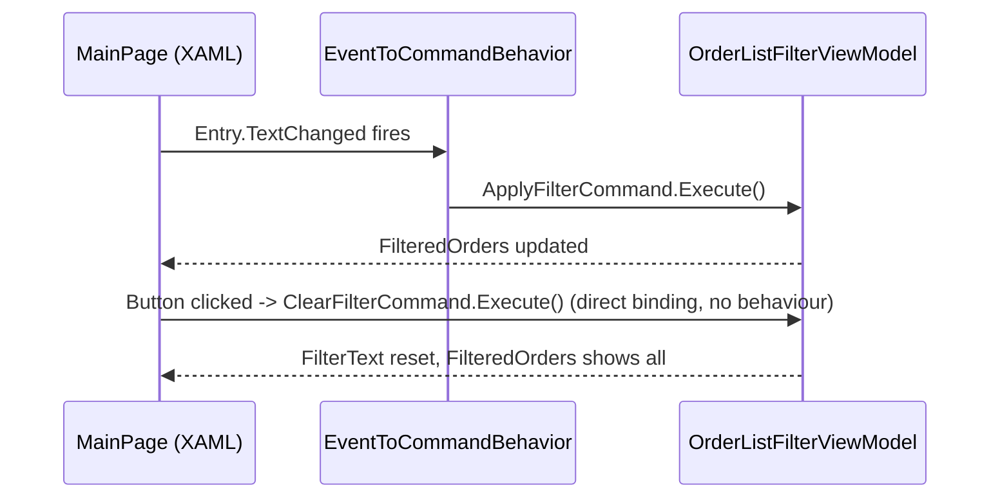

# Commanding and Behaviours

**Presentation & MVVM** — Structuring the view layer so it is testable, declarative and decoupled from platform UI

## Intent

Route every user interaction — whether the control natively supports commands or not — through
the same `ICommand`-based model, so view models stay testable and views stay free of event-handler
code-behind.

## The problem and context

A quick-filter bar over an order list needs two interactions: a "Clear" button (which supports
commands natively via its `Command` property) and live filtering as the user types into an `Entry`
(whose `TextChanged` event has no `Command` property at all). Handling the second in code-behind —
`private void OnTextChanged(object sender, TextChangedEventArgs e)` — would put filtering logic
back in the view, exactly what MVVM (this catalogue's first pattern) exists to avoid.

## The idiomatic approach

`OrderListFilterViewModel` (in `CommandBehavior.Core`) exposes two commands:

```csharp
[RelayCommand]
private void ApplyFilter() { /* filters FilteredOrders by FilterText */ }

[RelayCommand(CanExecute = nameof(CanClear))]
private void ClearFilter() { FilterText = string.Empty; ApplyFilter(); }

private bool CanClear() => !string.IsNullOrEmpty(FilterText);
```

`ClearFilterCommand` binds directly to the `Button`'s `Command` property. `ApplyFilterCommand` is
invoked through `CommunityToolkit.Maui`'s `EventToCommandBehavior`, attached to the `Entry`:

```xml
<Entry Text="{Binding FilterText, Mode=TwoWay}">
    <Entry.Behaviors>
        <toolkit:EventToCommandBehavior EventName="TextChanged" Command="{Binding ApplyFilterCommand}" />
    </Entry.Behaviors>
</Entry>
<Button Text="Clear" Command="{Binding ClearFilterCommand}" />
```

The behaviour listens for `TextChanged`, and on each occurrence invokes `ApplyFilterCommand` exactly
as if the `Entry` had a native `Command` property — no code-behind, no event handler.

## The manual alternative

The reference material shows the pre-behaviour alternative directly: a `Behavior<T>` subclass
overriding `OnAttachedTo`/`OnDetachingFrom` to manually register and unregister a .NET event
handler, then invoking the bound command from that handler. `EventToCommandBehavior` (from the
.NET MAUI Community Toolkit) is that exact pattern, generalised and packaged for reuse — writing a
bespoke behaviour per event name is no longer necessary for the common case.

## Why the idiomatic approach is preferable

A hand-written attached behaviour must get event subscription, unsubscription and command
invocation right for every event it targets; `EventToCommandBehavior` gets this once, and every
consuming view supplies only the event name and the command — the two facts specific to that
screen.

## Architecture and components



**Participants.** `MainPage` (`CommandBehavior.Demo`), `EventToCommandBehavior`
(`CommunityToolkit.Maui`, bridges the event that has no native command), `OrderListFilterViewModel`
(`CommandBehavior.Core`).

**Dependencies.** `.Core` depends only on `CommunityToolkit.Mvvm`. `.Demo` depends on `.Core`,
`Microsoft.Maui.Controls` and `CommunityToolkit.Maui` — a new central dependency this pattern
introduces (`Directory.Packages.props`, verified by execution before adoption).

## When to apply it

Any control interaction that maps naturally to a command — which is most interactions in an
enterprise screen. Prefer the direct `Command` binding where the control supports it; reach for a
behaviour only when it does not.

## When not to — over-application

Do not wrap every event in a behaviour reflexively. Where a control already exposes `Command`
(`Button`, `TapGestureRecognizer`), binding directly is simpler and needs no behaviour at all —
`ClearFilterCommand` demonstrates exactly that restraint.

## Production-readiness considerations

**Testability** — proven directly: both commands are exercised with no UI, no platform head.
**Maintainability** — `EventToCommandBehavior` is reused rather than hand-rolled per event, so a
second event-to-command bridge elsewhere in this repository needs no new behaviour class.

## Trade-offs

A behaviour adds one more moving part (the `EventName` string is not compile-time checked against
the control's actual events) compared with a control that natively exposes `Command` — a
misspelled event name fails silently at runtime rather than at compile time.

## Relationships

Builds on Model-View-ViewModel (this catalogue's first entry) — the view model shape is identical;
only the binding mechanism differs per control. Conceptually related to the **Adapter** pattern
from the Gang of Four catalogue (a behaviour adapts an event-based API to a command-based one) —
described here in prose only; no reference exists from this repository to
`csharp-project-001-gof-design-patterns`.

## What the tests assert

`CommandBehavior.Core.Tests` asserts: `ApplyFilterCommand` filters by a case-insensitive
substring match on customer reference; an empty filter shows every order; `ClearFilterCommand`'s
`CanExecute` tracks whether `FilterText` is empty, transitioning correctly as it is set, executed
and cleared; and executing `ClearFilterCommand` resets both `FilterText` and the filtered view.
