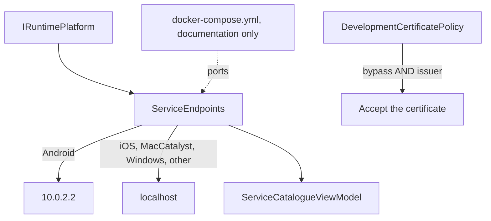

# Containerized Service Integration

**Data & Integration** — Reaching external systems and services the application depends on

## Intent

Reach services running in containers on a developer's machine from a .NET MAUI application, on
every platform, without weakening the application that ships.

## What this entry is not

**It is not a client for services that happen to run in containers.** That is
[Accessing Remote Data (REST)](../RemoteData/README.md), which covers the request, one attempt,
what is cached and how failure is reported. None of that changes because the service is a container.

**What changes is getting to it at all**, and that is entirely about the developer's machine. Two
things break the moment the service moves into a container on `localhost`:

* **the address**, which is different on every platform;
* **the certificate**, which neither mobile platform trusts.

Both are MAUI-specific, both are documented by Microsoft, and neither appears in row 6.

## The address, and why `localhost` is not one answer

| Platform | Host to use | Why |
|---|---|---|
| **Android emulator** | `10.0.2.2` | The emulator is "isolated from your development machine network interfaces, and runs behind a virtual router". `10.0.2.2` is documented as "an alias to your host loopback interface (127.0.0.1 on your development machine)" |
| **iOS simulator** | `localhost` | It "uses the host machine network" — **but see the caveat below, which no code can fix** |
| **Mac Catalyst, Windows** | `localhost` | These consume local services "without any additional work, provided that you've trusted your development certificate" |
| Anything else | `localhost` | Most likely a desktop test host. Refusing to resolve would break a test run for a case with a sensible answer |

**The caveat, attached here so it cannot be read apart from the table.** Running the iOS simulator
from a **Windows** machine executes the app on the paired Mac:

> there's no localhost access to a web service running in Windows for an iOS app running on a Mac.

The platform is iOS, the rule correctly chooses `localhost`, and `localhost` is the Mac. **No
address rule solves this.** Reach the Windows machine by its network address instead. The
demonstration says so on screen rather than presenting a table that quietly omits the case it
cannot handle.

Inside the emulator, `localhost` is the emulator — so the failure looks exactly like the service
being down, which is why this rule is worth its own entry.

## The certificate, and the one line that turns a convenience into a vulnerability

The ASP.NET Core development certificate is self-signed, and neither mobile platform trusts it.
Android throws `java.security.cert.CertPathValidatorException`; iOS returns an `NSURLErrorDomain`
error. Microsoft's remedy is a `ServerCertificateCustomValidationCallback`, wrapped in `#if DEBUG`.

**The obvious implementation is one condition, and one condition is not enough:**

```csharp
public static bool IsAcceptable(bool developmentBypassEnabled, string? certificateIssuer, SslPolicyErrors errors)
{
    if (errors == SslPolicyErrors.None)
    {
        return true;
    }

    return developmentBypassEnabled
        && string.Equals(certificateIssuer, DevelopmentCertificateIssuer, StringComparison.Ordinal);
}
```

**Enabling the bypass is necessary and never sufficient.** A callback that returned `true` whenever
a "development" flag was set is one careless line — a release build that sets it, a `#if DEBUG`
somebody widens — from trusting every certificate in production.

`#if DEBUG` is still used at the composition root, **and it is not the safeguard**: it cannot be
tested, and the issuer check can. Both are used, deliberately.

The fault plant for this pattern was removing the issuer check. **Two of fifteen tests failed** —
and the test named "the development certificate is accepted only when the bypass is enabled"
**still passed**, which is exactly why the safeguard needs its own test rather than an
adjacent-sounding one.

## Platform configuration, shown and not enabled

Clear-text HTTP to a container needs platform permission. These are reproduced so a reader knows
what to add, and are **deliberately absent from this demonstration**, which calls nothing:
configuration for a connection that is never made would be a permissive setting left in a
repository for somebody to copy.

**Android**, either `UsesCleartextTraffic` on the `Application` attribute, wrapped in `#if DEBUG`, or
a network security configuration naming the host alias:

```xml
<network-security-config>
  <domain-config cleartextTrafficPermitted="true">
    <domain includeSubdomains="true">10.0.2.2</domain>
  </domain-config>
</network-security-config>
```

Note that `UsesCleartextTraffic` "is ignored on Android 7.0 (API 24) and higher if a network
security config file is present" — so adding the file silently disables the attribute.

**iOS**, an Application Transport Security exception in `Info.plist`:

```xml
<key>NSAppTransportSecurity</key>
<dict>
    <key>NSAllowsLocalNetworking</key>
    <true/>
</dict>
```

## What Microsoft now recommends instead

Microsoft's own page opens by pointing past all of this:

> If you're using .NET 10 or later, consider using Aspire integration to simplify connecting to
> local web services. Aspire automatically handles platform-specific networking configuration,
> service discovery, and development tunnels, eliminating much of the manual configuration described
> in this article.

**.NET Aspire is the current answer**, and it needs packages this repository does not carry — adding
them changes shared configuration for every project here, which this programme treats as a stop
rather than a judgement call.

So this entry shows the manual configuration, and says plainly that it is what Aspire replaces. The
address rule and the certificate rule remain worth understanding: Aspire automates them, it does not
repeal them.

## Architecture and components



**Participants.**

| Participant | Project | Role |
|---|---|---|
| `IRuntimePlatform` | `ContainerServices.Core` | Which platform this is |
| `ServiceEndpoints` | `ContainerServices.Core` | The address rule |
| `DevelopmentCertificatePolicy` | `ContainerServices.Core` | The two-condition certificate rule |
| `ServiceCatalogueViewModel` | `ContainerServices.Core` | Shows each resolved address, and the caveat |
| `MauiRuntimePlatform` | `ContainerServices.Demo` | Adapts `DeviceInfo.Platform` |
| `docker-compose.yml` | this folder | **Documentation.** Never executed here |

**Dependencies.** `.Core` depends only on `CommunityToolkit.Mvvm`; `System.Net.Security` is in the
framework. This pattern adds no package.

**`.Core` keeps its own `RuntimePlatform`** rather than using `DeviceInfo.Platform`, for the reason
[Application Settings Management](../AppSettings/README.md) established by probe: referencing MAUI
from a plain `net10.0` project compiles and then throws
`NotImplementedInReferenceAssemblyException`.

## When to apply it

* A team runs its services in containers locally and the mobile client must reach them.
* The same application must work on an emulator, a simulator and a desktop head.
* A self-signed development certificate is in use, which it is by default.

## When not to — over-application

**Do not ship the bypass.** It is for a development certificate on a developer's machine, and the
issuer check is what keeps that true.

**Do not enable clear-text traffic to reach a container more easily.** It is a debug-only
accommodation, and `UsesCleartextTraffic` set outside `#if DEBUG` weakens every connection the
application makes.

**Do not hardcode an address anywhere but one place.** The rule is four lines; scattering it means
finding every copy when a platform's behaviour changes.

**Do not reach for this when the service is not local.** A deployed service has a real name and a
real certificate, and none of this applies.

## Production-readiness considerations

**Testability** — proven directly. The address rule and the certificate rule are ordinary functions,
tested without a device, an emulator or a container.

**The safeguard is tested, not asserted.** A test proves that enabling the bypass is insufficient by
itself. That test, not the `#if DEBUG`, is what would catch the mistake.

**The production branch is pinned from both sides.** A certificate with no errors is accepted; a
certificate with *any* error and no bypass is rejected. Without the second, widening the first would
pass every other test here.

**What was actually verified.** Every platform fact above is quoted from Microsoft Learn's *Connect
to local web services from Android emulators and iOS simulators*, read on 2026-09-17. **No container
was started, built or pulled, and no request was made.** The demonstration resolves addresses and
displays them; it compiles for all four platform heads and has not been run on a device.

## Trade-offs

**What it buys.** One place decides how a container is reached, the rule is inspectable on the
device where it matters, and the certificate accommodation is narrow enough to test.

**What it costs.** A platform abstraction to keep the rule testable, and a rule that is correct and
still cannot help the Windows-to-Mac simulator case. The `docker-compose.yml` here is also
documentation rather than something that runs, so it can drift from the ports in code — which is why
the ports appear in its comments as well.

## Relationships

Sits directly before **Accessing Remote Data (REST)**: this entry decides the base address, that one
decides what happens to the request. Uses **Dependency Injection** for the platform and the
catalogue, and **Model-View-ViewModel** for the screen. Related to **Application Settings
Management**, which faces the same `.Core`-cannot-reference-MAUI seam.

Conceptually the **Strategy** pattern from the Gang of Four catalogue — the host is chosen by
platform — and the **External Configuration Store** pattern from the cloud catalogue. Described in
prose only; this repository holds no reference to `csharp-project-001-gof-design-patterns` or
`csharp-project-002-cloud-design-patterns`.

## What the tests assert

`ContainerServices.Core.Tests` asserts that Android resolves to the emulator's host alias on the
service's own port; that iOS, Mac Catalyst, Windows and an unrecognised platform all resolve to
`localhost`; that two services share a host and keep separate ports; that the scheme is carried
through; that the catalogue resolves every service for the running platform; and that the iOS
caveat is carried on iOS and nowhere else.

For the certificate: that a certificate with no errors is accepted either way; that a certificate
with any error and no bypass is rejected; that the development certificate is accepted only with the
bypass; **that enabling the bypass is not sufficient, and any other issuer is still rejected**; and
that a missing issuer is rejected even with the bypass enabled.

The issuer check was removed and the tests re-run before it was restored. Two of fifteen failed.
