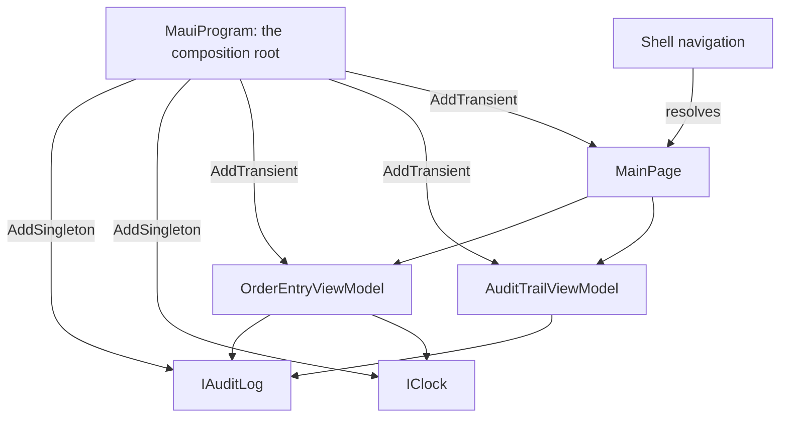

# Dependency Injection

**Application Infrastructure** — Composing and configuring the application itself, independent of any one feature

## Intent

Let a type state what it needs and let one place decide what that means, so the same type can be
built by a container in an application and by hand in a test.

## The problem and context

Two screens share an audit log. The order entry screen records what was ordered; the audit trail
screen lists it. **They must see the same log.**

A screen that builds its own log has built a *private* one, and the other screen will never see what
it wrote. Nothing about that code looks wrong — it compiles, the screen works alone, and the defect
appears only when two screens are put together.

The dependencies also have different correct lifetimes:

| Dependency | Lifetime | Why |
|---|---|---|
| `IAuditLog` | **singleton** | Shared state. Two screens, one log |
| `IClock` | **singleton** | Stateless, and injected so a test can fix the time |
| View models | **transient** | A fresh instance per navigation |
| `MainPage` | **transient** | The same |

## The idiomatic approach

Every type takes what it needs through its constructor and builds nothing:

```csharp
public OrderEntryViewModel(IAuditLog auditLog, IClock clock)
{
    _auditLog = auditLog;
    _clock = clock;
}
```

One place decides what those mean:

```csharp
builder.Services.AddSingleton<IAuditLog, InMemoryAuditLog>();
builder.Services.AddSingleton<IClock, SystemClock>();
builder.Services.AddTransient<OrderEntryViewModel>();
builder.Services.AddTransient<AuditTrailViewModel>();
builder.Services.AddTransient<MainPage>();
```

And the page states what it needs rather than building it:

```csharp
public MainPage(OrderEntryViewModel entry, AuditTrailViewModel trail)
```

**There is no `new` in that page constructor**, which is the line that separates this pattern from
every other demonstration in this repository. .NET MAUI resolves a registered page during Shell
navigation and injects its constructor arguments.

## Why the idiomatic approach is preferable

**Because the same constructor serves both callers.** A container resolves it in the application; a
test calls it directly:

```csharp
var log = new InMemoryAuditLog();
var entry = new OrderEntryViewModel(log, new FixedClock(Noon));
```

**No test in this pattern uses a container**, and that is the point rather than a simplification. A
type that a container can resolve is a type a test can build, and a type that builds its own
dependencies is neither.

## The lifetime that does not do what its name suggests

`AddScoped` is the trap. Microsoft warns:

> In .NET MAUI (non-Blazor) apps, `AddScoped` has **no natural scope boundary**. Unlike ASP.NET Core
> (which scopes per HTTP request) or Blazor (which scopes per circuit), .NET MAUI does not
> automatically create or dispose scopes during navigation.

Measured rather than assumed. On .NET runtime 10.0.11, resolving each lifetime twice from the root
provider — which is how a .NET MAUI page resolves, because nothing creates a scope:

```
singleton from root twice   : same instance = True
transient from root twice   : same instance = False
scoped    from root twice   : same instance = True   <-- the trap
scoped    twice in one scope: same instance = True
scoped    across two scopes : same instance = False
```

**The registration is not broken, and `AddScoped` does not "become" `AddSingleton`.** The last two
lines show it behaving exactly as designed once a scope exists. .NET MAUI simply never creates one,
so there is one implicit scope — the root — for the life of the application.

A developer arriving from ASP.NET Core will reach for `AddScoped` and get a shared instance with
none of the warnings they are used to.

**Use `AddTransient` for pages and view models. Use `AddSingleton` for shared services. Reach for
`AddScoped` only where something creates a scope through `IServiceScopeFactory`.**

## Architecture and components



**Participants.**

| Participant | Project | Role |
|---|---|---|
| `IAuditLog`, `IClock` | `DependencyInjection.Core` | What the view models need, as interfaces |
| `InMemoryAuditLog` | `DependencyInjection.Core` | The shared implementation |
| `OrderEntryViewModel` | `DependencyInjection.Core` | Records, and builds nothing |
| `AuditTrailViewModel` | `DependencyInjection.Core` | Reads the same log |
| `MauiProgram` | `DependencyInjection.Demo` | The composition root |
| `SystemClock` | `DependencyInjection.Demo` | The real clock, in UTC |
| `MainPage` | `DependencyInjection.Demo` | States what it needs |

**Dependencies.** `.Core` depends only on `CommunityToolkit.Mvvm` and **references no container at
all** — neither does the test project. That is deliberate: a domain project that references a
container has made the container part of the domain.

**The clock returns `UtcNow`, not `Now`.** `Now` carries the device's offset, so two devices in
different time zones would stamp the same moment differently, and an audit trail is exactly where
that matters.

## When to apply it

* Two or more parts of an application must share one instance of something.
* A type's dependency should be substitutable — in a test, or per platform.
* The application has enough moving parts that wiring them by hand has become the thing most likely
  to be got wrong.

## When not to — over-application

**Do not put a class in the container because the container exists.** Microsoft's own caution:

> Dependency injection containers are not always suitable for a .NET MAUI app. Dependency injection
> introduces additional complexity and requirements that might not be appropriate or useful to
> smaller apps. If a class doesn't have any dependencies, or isn't a dependency for other types, it
> might not make sense to put it in the container.

**The other five patterns in this repository are the boundary, and they are not a backlog.**
Model-View-ViewModel, Commanding and Behaviours, Loosely-Coupled Messaging, Navigation and Validation
each compose by hand, in a page constructor or a small static class. Each has one screen and a
dependency or two. A container would add a registration list and remove nothing. **None of them was
converted for this entry**, which would have been five breaking changes to make one point.

**Do not resolve services from inside a type.** .NET MAUI allows it through
`Handler.MauiContext.Services`, and Microsoft names the drawback: the type acquires a dependency on
the application. A type that pulls its dependencies hides them from its constructor, from the
container, and from a test.

**Do not register a page as a singleton to save an allocation.** A singleton page keeps its state
across navigations, so a form the user filled in is still filled in when they return to it.

## Production-readiness considerations

**Testability** — proven directly. Every test constructs its subject with fakes and no container.

**Shared mutable state** — `IAuditLog` is a singleton, so its reads return a **snapshot** rather than
the live collection. A caller that could mutate what it reads could corrupt what the other screen
sees; the singleton lifetime is what turns that from a theoretical concern into a real one.

**Staleness** — a dependency that outlives its consumer can change without the consumer acting, so
`AuditTrailViewModel` exposes a refresh. A view bound to a longer-lived dependency has to be told to
look again.

**What was actually verified.** The lifetime figures above were produced by running a program
against `Microsoft.Extensions.DependencyInjection` outside this repository, so that no container
package had to be added to shared configuration. The demonstration compiles for all four platform
heads — Android, iOS, Mac Catalyst and Windows — and has **not** been run on a device or an emulator.
**That Shell resolves and injects the registered page is Microsoft's documented contract and is
compiled here, not observed here.**

## Trade-offs

**What it buys.** One place decides how the application is wired, lifetimes become a stated decision
rather than an accident of where `new` was typed, and every type stays testable.

**What it costs.** A registration list that the compiler does not check: a type resolved without
being registered fails at run time, not at build time. Constructor injection also pushes dependencies
outward, so a type deep in a call chain adds a parameter to everything that builds it — which is a
pressure worth listening to rather than working around.

## Relationships

Underpins every other entry in this catalogue: **Model-View-ViewModel** view models, the
**Loosely-Coupled Messaging** messenger, the **Navigation** service and the **Validation** approval
policy are all constructor dependencies, and each of those patterns took them that way before a
container existed here. That is the order it should happen in — **constructor injection first, and a
container only when the wiring has earned one.**

Conceptually the **Dependency Inversion Principle**, and the **Factory** and **Service Locator**
patterns from the Gang of Four catalogue — the container is a factory, and the anti-pattern this
entry warns against is the locator. Described in prose only; this repository holds no reference to
`csharp-project-001-gof-design-patterns` or `csharp-project-003-solid-principles`.

## What the tests assert

`DependencyInjection.Core.Tests` asserts that recording an order adds an entry; that the entry
carries the injected clock's time exactly rather than roughly; that two view models given the same
log see each other's entries and two given separate logs do not; that entries come back newest
first; that what a caller reads cannot change what the log holds; that a blank description is
refused and records nothing; and that refreshing the trail shows what was recorded after it was
built.

**The sharing tests prove that the view models use what they are given rather than building their
own.** They do not test `AddSingleton`, which no test here uses — the lifetime evidence is the
measured output above.

The defect the pattern prevents was planted, by making the view model build its own log. Five of the
eight tests failed. Planted in its simplest form it does not even compile: the analyser reports
`CA1859`, having noticed that the interface became pointless the moment nothing was injected through
it.
