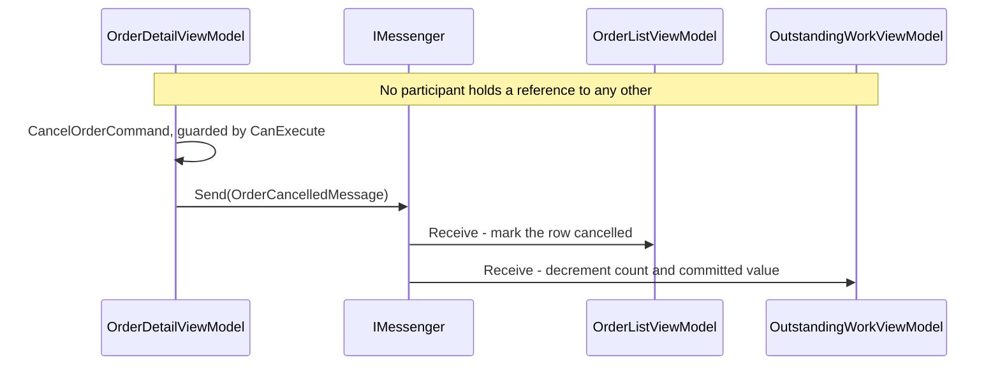

# Loosely-Coupled Messaging

**Presentation & MVVM** — Structuring the view layer so it is testable, declarative and decoupled from platform UI

## Intent

Let one part of an application announce that something happened, and let other parts react, without
any of them holding a reference to the others.

## The problem and context

A user cancels an order on the order detail screen. Two other parts of the application must show
the change immediately:

* the **order list**, which must show that row as cancelled;
* the **outstanding-work summary**, which must reduce its count and its committed value.

The detail screen has no reference to either, and must not acquire one. The three are created at
different times, by different navigation, and two of them are not on screen when the cancellation
happens.

Two designs avoid messaging, and both cost more than they save:

1. **Give the detail screen a reference to the other two.** The leaf of one navigation stack now
   knows the internals of another. Every new reaction to a cancellation changes the detail screen.
2. **Route the change through a shared service that raises a .NET event.** The publisher and
   subscriber lifetimes are now coupled through the service, which outlives every screen. A screen
   that forgets to unsubscribe stays alive for as long as the service does.

## The idiomatic approach

`OrderDetailViewModel` sends a message. It names no recipient:

```csharp
_messenger.Send(new OrderCancelledMessage(new OrderCancellation(Order.Id, CancellationReason)));
```

Each recipient declares which message it wants, and handles it:

```csharp
public sealed partial class OrderListViewModel : ObservableObject,
    IRecipient<OrderCancelledMessage>, IDisposable
{
    public OrderListViewModel(IMessenger messenger, IEnumerable<OrderSummary> orders)
    {
        _messenger = messenger;
        Orders = new ObservableCollection<OrderSummary>(orders);

        // Deliberately the last statement.
        _messenger.RegisterAll(this);
    }

    public void Receive(OrderCancelledMessage message) { /* mark the row cancelled */ }

    public void Dispose() => _messenger.UnregisterAll(this);
}
```

`OutstandingWorkViewModel` does the same for a different purpose. Neither recipient knows the other
exists, and the publisher knows neither.

**The messenger is a constructor dependency, never a static.** No participant reads
`WeakReferenceMessenger.Default`. The host decides which messenger is in use, so a test can supply
its own.

## The manual alternative

.NET MAUI shipped `MessagingCenter` for this purpose. **It is deprecated.** Microsoft's guidance
states:

> MessagingCenter is deprecated in .NET 10. We recommend migrating to `WeakReferenceMessenger` from
> the CommunityToolkit.Mvvm package, or using events with weak references for simple scenarios.

**In practice it is already stronger than "deprecated".** Verified by execution rather than
assumed: a `MessagingCenter.Send` call added to the demonstration does not compile.

```
error CS0122: 'MessagingCenter' is inaccessible due to its protection level
```

The same error appears when the name is written in full as
`Microsoft.Maui.Controls.MessagingCenter`, which rules out a name-resolution accident. The type
still exists in **Microsoft.Maui.Controls 10.0.100**, the version this repository pins, but it is no
longer public.

This matters more than a deprecation notice does. `CS0122` is an error on its own, so
`TreatWarningsAsErrors` is not what stops the build and switching that setting off would not help.
For a project on this package version, migrating is not advice. The old code does not build. The
planted call was removed and the build re-run clean.

Note the distinction: Microsoft's documentation describes the API as deprecated and still shows how
to use it. Whether it is *accessible* depends on the package version in use, and this repository
pins a version where it is not.

`MessagingCenter` messages were identified by a **string**, so a typographical error produced
silence rather than a compiler error, and the payload type was carried in generic arguments that
publisher and subscriber had to state identically. The Toolkit's messages are types, so both
problems become compile-time errors.

## Why the idiomatic approach is preferable

| | `MessagingCenter` | `IMessenger` |
|---|---|---|
| Message identity | a string, matched at run time | a type, matched at compile time |
| A misspelled message | silence | does not compile |
| Payload agreement | repeated generic arguments | a property on the message |
| Substituting it in a test | not designed for it | an interface, injected |
| Supported | deprecated in .NET 10, and inaccessible in the pinned package | current guidance |

The last row decides it on its own. The rest explain why the replacement is an improvement rather
than a lateral move.

## Architecture and components



**Participants.**

| Participant | Project | Role |
|---|---|---|
| `OrderDetailViewModel` | `Messaging.Core` | Publisher. Cancels an order and announces it |
| `OrderCancelledMessage` | `Messaging.Core` | The contract, carrying an `OrderCancellation` payload |
| `OrderListViewModel` | `Messaging.Core` | Recipient. Marks the row cancelled |
| `OutstandingWorkViewModel` | `Messaging.Core` | Recipient. Reduces the count and the committed value |
| `MainPage` | `Messaging.Demo` | Host. Creates the messenger and the three view models |

**Dependencies.** `.Core` depends only on `CommunityToolkit.Mvvm`, which is already central to this
repository and which contains `CommunityToolkit.Mvvm.Messaging`. This pattern adds no package.
`.Demo` depends on `.Core` and the MAUI packages the other demonstrations use. It does **not** use
`CommunityToolkit.Maui`, which is a different package and is not needed here.

**Each participant holds its own order instances**, as three screens fed by three separate queries
would. If the publisher and the list shared one mutable instance, the list would update through
that shared reference and the message would be doing no work at all.

## When to apply it

* Several parts of an application must react to one event, and the publisher should not be changed
  when a new reaction is added.
* The publisher and the recipients have unrelated lifetimes, or live on different navigation
  stacks.
* A direct reference would point the wrong way — from a leaf screen towards a screen that owns it.

## When not to — over-application

**Do not use it between a control and the page that contains it.** Microsoft's own guidance is that
ordinary .NET events are sufficient for local communication. A message there replaces a reference
the compiler checks with a subscription that nothing checks.

**Do not use it to fetch a value.** The messenger supports request messages (`RequestMessage<T>`
and its asynchronous and collection variants), and they work. A caller that needs an answer usually
wants a service with a method, which states its dependency honestly and can be mocked.

**Do not send a message that only one recipient will ever handle.** That is a method call written
in a way that hides who is called. The gain of this pattern is many recipients and no reference,
not indirection for its own sake.

**Watch the fan-out.** A message goes to every recipient. Once several parts of an application
react to one message, tracing what happens after a user action means finding every recipient,
because the send site names none of them.

## Production-readiness considerations

**Testability** — proven directly. Every participant takes `IMessenger`, so each test builds its
own messenger. `WeakReferenceMessenger.Default` is process-wide, xUnit runs test classes in
parallel, and a shared default would leak registrations between tests and fail only sometimes.

**Lifetime** — each recipient registers in its constructor and unregisters in `Dispose`.
`WeakReferenceMessenger` holds recipients weakly and **does not leak without this**; the Toolkit's
documentation calls unregistering good practice rather than a requirement. The member exists so
this implementation stays correct if the messenger is ever changed to `StrongReferenceMessenger`,
which holds recipients strongly and does leak.

**The demonstration does not reach `Dispose`.** Both recipients live as long as the page, and the
page lives as long as the application. The tests are what exercise unregistration.

**What was actually verified.** The demonstration compiles for all four platform heads — Android,
iOS, Mac Catalyst and Windows — and it has **not** been run on a device or an emulator in this
repository. Every behavioural claim on this page rests on `Messaging.Core` and its tests, which need
no platform head.

**Initialisation order** — `RegisterAll` is the last statement of every recipient constructor.
Before that line the messenger cannot reach the instance; after it, a send from another thread can.
Registering earlier would expose a partly-built object.

**Duplicate sends** — the publisher guards, and the guard is load-bearing. `OutstandingWorkViewModel`
subtracts on every message it receives and defends itself against nothing, so a duplicate send
would corrupt its totals. Guarding once at the publisher is cheaper than defending in every
recipient.

## Trade-offs

**What it buys.** A new reaction to a cancellation costs one new recipient and no change to the
publisher. Screens with unrelated lifetimes stay independent, and each is testable alone.

**What it costs.** The connection between publisher and recipient is no longer visible in the code.
No compiler error follows from deleting a recipient, and no tool reports that a message now has
none: `Send` with no recipients registered succeeds silently, which is the property the pattern
depends on and also the one that hides a mistake. Ordering between recipients is not defined, so no
recipient may depend on another having run.

## Relationships

Builds on **Model-View-ViewModel**, this catalogue's first entry: the participants are view models
of exactly that shape, and messaging changes only how they learn of each other's work. Related to
**Commanding and Behaviours**, whose commands are how the publisher here is triggered.

Conceptually the **Observer** and **Mediator** patterns from the Gang of Four catalogue: recipients
observe a message type, and the messenger mediates so no participant refers to another. Described
in prose only; this repository holds no reference to
`csharp-project-001-gof-design-patterns`.

## What the tests assert

`Messaging.Core.Tests` asserts that a cancellation reaches the list with no reference between
publisher and recipient; that one send reaches both recipients, which know nothing of each other;
that a disposed recipient stops receiving while a registered one continues; that a second
cancellation sends nothing, observed on the recipient whose state would change if it did; that
recipients registered on a different messenger receive nothing, which is what makes injecting the
messenger a demonstrated property rather than a preference; that a send with no recipients does not
throw; and that the command is refused until a reason is given.

The guard was removed and the tests were re-run before the guard was restored, to confirm that the
test which claims to prove it can fail without it.
