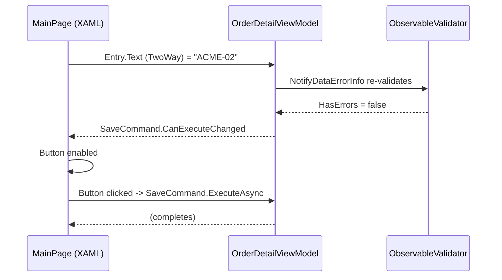

# Model-View-ViewModel

**Presentation & MVVM** — Structuring the view layer so it is testable, declarative and decoupled from platform UI

## Intent

Keep an enterprise .NET MAUI screen's state, validation and commands in a plain, testable class
that the view binds to declaratively, so the screen's logic can be verified without a device,
an emulator, or the view itself.

## The problem and context

An order-detail screen needs to load an order, let the user edit a field, validate what they typed,
and only allow saving once the input is valid. Written directly in code-behind, that logic is
inseparable from `Entry`, `Button` and platform lifecycle events — it cannot be unit tested without
instantiating the UI, and every enterprise screen this repository will eventually add repeats the
same problem.

## The idiomatic approach

`OrderDetailViewModel` (in `Mvvm.Core`, a plain class library with no MAUI reference) derives from
`CommunityToolkit.Mvvm`'s `ObservableValidator` and uses source-generated properties and commands:

```csharp
public sealed partial class OrderDetailViewModel : ObservableValidator
{
    public OrderDetailViewModel(Order order)
    {
        _customerReference = order.CustomerReference;
        ValidateAllProperties();
    }

    [ObservableProperty]
    [NotifyCanExecuteChangedFor(nameof(SaveCommand))]
    [NotifyPropertyChangedFor(nameof(FirstError))]
    [NotifyDataErrorInfo]
    [Required]
    private string _customerReference;

    [RelayCommand(CanExecute = nameof(CanSave))]
    private async Task SaveAsync(CancellationToken cancellationToken)
    {
        await Task.CompletedTask;
    }

    private bool CanSave() => !HasErrors;
}
```

`[ObservableProperty]` generates the public `CustomerReference` property and its
`INotifyPropertyChanged` plumbing; `[NotifyDataErrorInfo]` re-validates on every change and raises
`ErrorsChanged`; `[NotifyCanExecuteChangedFor]` re-evaluates `SaveCommand.CanExecute` automatically
whenever the field changes; `[RelayCommand(CanExecute = ...)]` generates `SaveCommand` as an
`IAsyncRelayCommand` gated by `CanSave`.

`Mvvm.Demo`'s `MainPage.xaml` binds to exactly this surface — an `Entry` two-way bound to
`CustomerReference`, a `Button` bound to `SaveCommand`, an error `Label` bound to `FirstError` — with
no logic in `MainPage.xaml.cs` beyond constructing the view model.

## The manual alternative

The reference material's own MVVM Toolkit Features chapter draws this exact contrast: before the
toolkit's source generators, the same behaviour required a hand-written backing field, a
hand-written `CustomerReference` property that calls `SetProperty` (or raises
`PropertyChanged` itself), a hand-written `ICommand` implementation tracking `CanExecute`, and
manual wiring between the two so that a property change re-evaluates the command. Every one of
those four pieces is boilerplate that the source generator now produces from four attributes.

## Why the idiomatic approach is preferable

The generated code is what the manual version would have to be to be correct — `SaveCommand`'s
`CanExecute` cannot silently fall out of sync with validity, because `[NotifyCanExecuteChangedFor]`
wires that dependency at compile time rather than relying on the author remembering to call
`RaiseCanExecuteChanged` everywhere `CustomerReference` changes. The manual version is not wrong in
principle, only in the number of places it can be wrong in practice.

## Architecture and components



**Participants.** `MainPage` (the view, `Mvvm.Demo`), `OrderDetailViewModel` (`Mvvm.Core`),
`ObservableValidator` (`CommunityToolkit.Mvvm`, the validation base class), `Order` (the immutable
input record).

**Dependencies.** `Mvvm.Core` depends only on `CommunityToolkit.Mvvm` and
`System.ComponentModel.DataAnnotations`. `Mvvm.Demo` depends on `Mvvm.Core` and
`Microsoft.Maui.Controls`. No dependency runs the other way: `Mvvm.Core` has no reference to MAUI at
all, which is what makes it testable without a platform head.

## When to apply it

Any screen with editable state, validation, and an action gated on that state — which is most
enterprise line-of-business screens. Apply it as the default shape for a new screen rather than
special-casing simple ones; the pattern's cost (one view model class) is small relative to a screen
that later grows validation it was not structured to hold.

## When not to — over-application

A screen with no state of its own — a static informational page, for example — gains nothing from a
view model and should not be forced to have one merely for consistency. Introducing
`INotifyPropertyChanged` machinery around content that never changes is complexity with no
corresponding benefit.

## Production-readiness considerations

**Testability** — proven directly: `Mvvm.Core.Tests` exercises the view model with no UI, no
platform head, no device. **Maintainability** — the generated properties and commands remove an
entire class of hand-written synchronisation bugs (see "Why the idiomatic approach is preferable").
**Observability, security, performance** are not materially engaged by this pattern in isolation;
they become relevant once a view model performs I/O, which later catalogue entries (Accessing
Remote Data, Authentication) will address directly rather than this one asserting coverage it does
not have.

## Trade-offs

The source generators require the `partial` keyword and `CommunityToolkit.Mvvm`'s attribute-based
style, which is a small departure from plain C# for a reader unfamiliar with the toolkit — offset by
removing the boilerplate that style otherwise requires by hand.

## Relationships

Every later Presentation & MVVM catalogue entry (Commanding and Behaviours, Loosely-Coupled
Messaging, Navigation, Validation) builds on a view model shaped this way. Conceptually related to
the **Observer** pattern (`INotifyPropertyChanged` is a structured form of it) and to
**Command** (`IAsyncRelayCommand`) from the Gang of Four catalogue — described here in prose only;
no reference exists from this repository to `csharp-project-001-gof-design-patterns`.

## What the tests assert

`Mvvm.Core.Tests` asserts: an empty customer reference produces a validation error and disables
`SaveCommand`; a valid customer reference clears the error and enables `SaveCommand`; constructing
the view model from an `Order` seeds `CustomerReference` and starts valid; `SaveCommand` stays
disabled while the view model is invalid, and executing it while disabled does not throw; and that
enabling, disabling and re-enabling `SaveCommand` across multiple edits tracks validity correctly
each time, not merely on the first transition.
