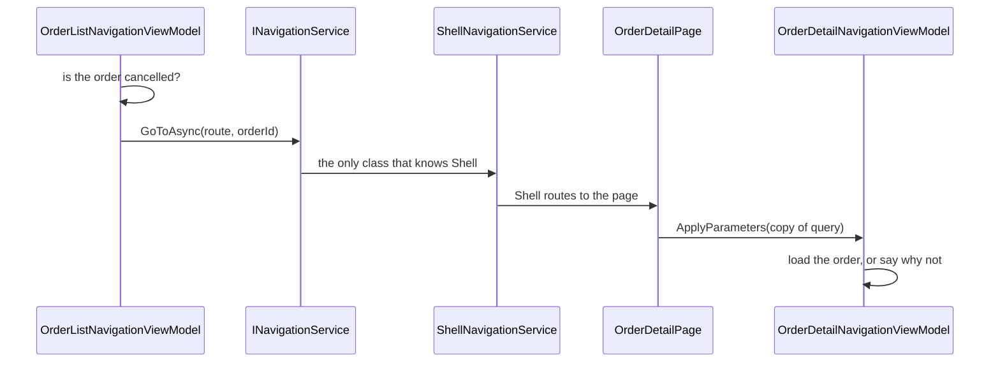

# Navigation

**Presentation & MVVM** — Structuring the view layer so it is testable, declarative and decoupled from platform UI

## Intent

Let a view model decide where the application goes next, and prove that decision with a test that
needs no platform.

## The problem and context

An order list opens an order. Which screen it opens is a business decision, not a display one: an
outstanding order opens for editing, and a **cancelled order opens read-only**, because a cancelled
order is a financial record and editing it would change what was already reported.

That decision must be tested. Written the direct way, it cannot be:

```csharp
// In a view model. This cannot be tested.
await Shell.Current.GoToAsync($"orderdetail?orderId={order.Id}");
```

`Shell.Current` is `null` outside a running application, so the test throws before reaching the
assertion. Worse, the line does not compile in `Navigation.Core` at all, because the `.Core`
projects in this repository deliberately do not reference `Microsoft.Maui.Controls`.

Microsoft's own architecture guidance gives the same reason:

> A navigation service is typically invoked from view-models, in order to promote testability.
> Placing navigation logic in view-model classes means that the logic can be exercised through
> automated tests.

## The idiomatic approach

Two small interfaces in `.Core`, one for each direction.

**Outbound** — the view model asks, and does not know who answers:

```csharp
public interface INavigationService
{
    Task GoToAsync(string route, IReadOnlyDictionary<string, object>? parameters = null);
    Task GoBackAsync();
}
```

**Inbound** — the view model is told what the navigation carried:

```csharp
public interface INavigationParameterReceiver
{
    void ApplyParameters(IReadOnlyDictionary<string, object> parameters);
}
```

.NET MAUI's own inbound interface is `IQueryAttributable`, which is a `Microsoft.Maui.Controls`
type. `.Core` cannot implement it, so the page implements it and forwards:

```csharp
public void ApplyQueryAttributes(IDictionary<string, object> query)
{
    // Copied, not cast: the interface promises only IDictionary, and Shell may retain or clear
    // its own dictionary afterwards.
    _viewModel.ApplyParameters(new Dictionary<string, object>(query));
}
```

**That forwarding line is the entire seam.** Everything above it is testable; everything below it is
Shell.

The business rule then lives where it can be proven:

```csharp
var route = order.State == OrderState.Cancelled
    ? OrderRoutes.OrderAudit
    : OrderRoutes.OrderDetail;
```

## The manual alternative

Calling `Shell.Current.GoToAsync` from the view model, or handling a tap in code-behind and pushing
a page from there. Both work, and both put the decision somewhere no test can reach it.

Route names deserve the same treatment. They are used where the route is registered, where
navigation is requested, and in the tests — three string literals that must agree, with nothing to
report it when they do not. `OrderRoutes` declares each once. This is the same defect class that
`MessagingCenter`'s string message identifiers had, described in
[Loosely-Coupled Messaging](../Messaging/README.md), and it is not worth reintroducing one pattern
later.

## Why the idiomatic approach is preferable

| | Direct `Shell.Current` call | `INavigationService` |
|---|---|---|
| Testing the decision | needs a running application | a recording fake, no platform |
| `.Core` dependencies | requires `Microsoft.Maui.Controls` | none beyond the MVVM toolkit |
| Where a business rule lives | wherever the call happens to be | in the view model, with one place to change |
| Substituting navigation | not designed for it | an interface, injected |

## Architecture and components



**Participants.**

| Participant | Project | Role |
|---|---|---|
| `INavigationService` | `Navigation.Core` | The outbound contract |
| `INavigationParameterReceiver` | `Navigation.Core` | The inbound contract |
| `OrderRoutes` | `Navigation.Core` | Route and parameter names, declared once |
| `OrderListNavigationViewModel` | `Navigation.Core` | Decides which screen an order opens |
| `OrderDetailNavigationViewModel` | `Navigation.Core` | Receives the parameters and loads the order |
| `ShellNavigationService` | `Navigation.Demo` | The only class that knows Shell exists |
| `OrderDetailPage`, `OrderAuditPage` | `Navigation.Demo` | Implement `IQueryAttributable` and forward |

**Dependencies.** `.Core` depends only on `CommunityToolkit.Mvvm`. This pattern adds no package.

## Two Shell facts worth knowing before you use it

**Route templates reject relative navigation.** Microsoft states: "Route templates only work with
absolute navigation. Attempting to navigate to a route template with a relative URI, such as
`await Shell.Current.GoToAsync("trip/SEA-204")`, throws an `ArgumentException`."

**The navigation stack is not a list you edit.** "`Tab.Stack` is a read-only collection... All
navigation changes must go through `GoToAsync`." To reset the stack use an absolute route
(`//route`); to go back use `..`.

## How parameters are passed, and why it is not the obvious overload

Shell offers two object-based overloads, and they behave differently.

| | `IDictionary<string, object>` | `ShellNavigationQueryParameters` |
|---|---|---|
| Lifetime | "retained in memory for the lifetime of the page" | "cleared after navigation has occurred" |
| On navigating back | delivered **again** | not delivered again |
| Suits | data the page should keep | single-use data |

Microsoft's own example of the first: `Page1` passes `MyData` to `Page2`; `Page2` goes to `Page3`;
`Page3` goes back, and **`Page2` receives `MyData` a second time**.

`ShellNavigationService` uses **`ShellNavigationQueryParameters`**. An order identifier is
single-use: being handed it again on the way back would re-run whatever the receiving view model
does with it, which is a surprise, and a surprise in a reference implementation gets copied.

## A name collision this pattern cannot avoid

`ContentPage` and `Shell` both inherit a `Navigation` property from `NavigableElement`. Inside any
class deriving from them, the identifier `Navigation` binds to **that property**, not to this
pattern's namespace. A qualified type reference fails:

```
error CS0120: An object reference is required for the non-static field, method, or property
'NavigableElement.Navigation'
```

Confirmed by planting exactly that reference and building. **Use a `using Navigation.Core;`
directive and simple type names** — a using directive is resolved at namespace level and is
unaffected. Every page in this demonstration does that, which is why it compiles.

## When to apply it

* A navigation decision depends on state or a business rule, rather than being a fixed link.
* The same destination is reached from more than one place, and the rule must hold at each.
* The view model needs testing, which in an enterprise application is all of them.

## When not to — over-application

**Do not wrap navigation that has no decision in it.** A button that always opens the same screen,
with no rule and no parameters, gains a layer and proves nothing.

**Do not let the interface grow into Shell.** If `INavigationService` acquires modal flags,
animation control and stack inspection, it has become Shell with extra steps and is no longer
substitutable. Keep it to what view models actually decide.

**Do not put the rule in the destination.** Deciding in the destination leaves the editable screen
reachable and relying on every future caller to remember the check. Deciding at the one navigation
point means there is one place to get right.

## Production-readiness considerations

**Testability** — proven directly. `RecordingNavigationService` records requests and asserts
nothing, so failures are reported from the test rather than from the fake, and one fake serves every
expectation.

**Hostile input** — `ApplyParameters` receives `IReadOnlyDictionary<string, object>`, about which
the compiler guarantees nothing. A missing key, a value of the wrong type and an unknown identifier
each produce a stated `Problem` rather than an exception. With single-use object data an `int`
arrives as an `int`; through a **query string every value arrives as a `string`**, so both are
accepted and a later change of navigation style cannot break this silently.

**Asynchrony** — navigation returns `Task`, so the commands are `AsyncRelayCommand`. Tests await
`ExecuteAsync`. Calling `Execute` returns before the work finishes, and an assertion after it would
pass or fail on timing.

**What was actually verified.** The demonstration compiles for all four platform heads — Android,
iOS, Mac Catalyst and Windows — and has **not** been run on a device or an emulator. Every
behavioural claim here rests on `Navigation.Core` and its tests, which need no platform.

## Trade-offs

**What it buys.** The navigation decision becomes ordinary logic: testable, reviewable, and in one
place.

**What it costs.** A layer, and a route name that is still a string at the Shell boundary — the
constant makes the three uses agree with each other, not with Shell's own registration table. The
seam is also only as good as its narrowest point: the forwarding line in each page is untested here,
because testing it needs a platform.

## Relationships

Builds on **Model-View-ViewModel**, and uses **Commanding and Behaviours** — the list's
`OpenOrderCommand` is the command pattern applied to a navigation decision. Sits beside
**Loosely-Coupled Messaging**: messaging tells other parts of the application that something
happened, while navigation moves the user, and the two are often confused. A message is not a way to
navigate.

Conceptually the **Strategy** and **Facade** patterns from the Gang of Four catalogue —
`INavigationService` is a narrow facade over Shell, and substituting the implementation is strategy
substitution. Described in prose only; this repository holds no reference to
`csharp-project-001-gof-design-patterns`.

## What the tests assert

`Navigation.Core.Tests` asserts that the list exposes the orders it was given, in order; that
opening an outstanding order requests the editable route carrying the identifier; that opening a
cancelled order requests the audit route instead, which is the business rule; that opening nothing
navigates nowhere; that going back asks to go back rather than to a route; and that
`ApplyParameters` loads the right order from an integer and from a string, and reports a stated
problem for a missing key, a wrong type and an unknown identifier.

The business rule was removed and the tests re-run before it was restored, to confirm that the test
which claims to prove it can fail without it. Eight of the nine still passed; only that one caught
it.
