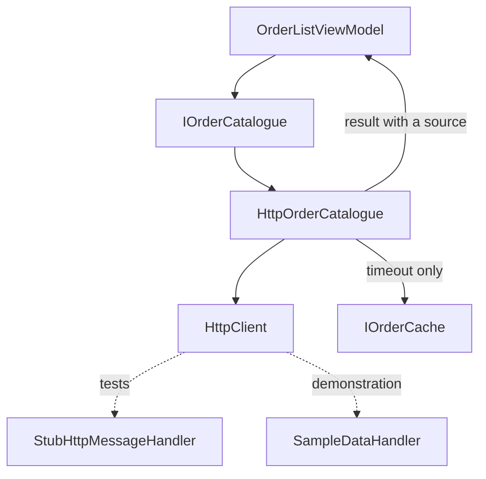

# Accessing Remote Data (REST)

**Data & Integration** — Reaching external systems and services the application depends on

## Intent

Read from a service once, and tell the caller honestly what happened — including when the answer is
old, and including when the caller is the one who stopped asking.

## The problem and context

An order list is held by a service. A mobile client asks for it over a connection that may be slow,
absent, or interrupted by the user walking away from the screen.

The request has more outcomes than "worked" and "failed":

| What happened | What the user should see |
|---|---|
| The service answered | The orders |
| The service did not answer in time | The last orders received, **marked as not current** |
| The service answered with an error | The error. **Not** stale orders |
| The body was not orders | A problem. **Not** stale orders |
| The user left the screen | Nothing at all |

**The last two rows are where this goes wrong**, and they are the reason this entry exists.

## The behaviour that surprises people

A client timeout and a caller's cancellation arrive as **the same exception type**. Measured on
.NET 10.0.11 rather than assumed:

```
timeout     : TaskCanceledException; inner = TimeoutException
cancelled   : TaskCanceledException; token was cancelled = True
404 json    : HttpRequestException
500 getasync: did not throw; IsSuccessStatusCode = False, status = 500
empty body  : JsonException
```

So `catch (TaskCanceledException)` cannot tell **"the server did not answer"** from **"the user
navigated away"** — and those want opposite handling. Treating them alike either reports failures
the user caused deliberately, or silently swallows real ones.

They are told apart by the caller's own token:

```csharp
// ORDER MATTERS. This filtered catch must come first.
catch (OperationCanceledException) when (cancellationToken.IsCancellationRequested)
{
    throw;   // the caller asked to stop; it gets nothing, not even the cache
}
catch (OperationCanceledException)
{
    // the client's own timeout fired
}
```

**The token is checked rather than the inner exception.** `TimeoutException` is present on this
runtime and is an implementation detail; the caller's token is the thing the caller owns.

**Two more from the same table.** `GetAsync` does **not** throw on a 500 — code that forgets to ask
will carry on and try to deserialise the error page. And `GetFromJsonAsync` **does** throw on a 404,
because it calls `EnsureSuccessStatusCode` for you. Two methods on the same client with opposite
failure conventions.

## What is cached, and what is not

Not every failure earns stale data:

| Failure | Cached value returned? | Why |
|---|---|---|
| Timeout | **Yes**, marked `Cache` | We do not know the answer, so the last one is better than nothing |
| Non-success status | No | The server knows, and said no. Stale data would hide that |
| Unreachable host | No | A refused connection is a fact the user should see |
| Body was not orders | No | Hiding a broken contract behind old data delays finding it |
| Caller cancelled | No | There is no caller left to show it to |

A screen that cannot tell live from stale will present a month-old answer as current, so `Source` is
part of the result rather than a detail of how it was fetched.

## One attempt, by design

This entry makes **exactly one request**. No retry, no backoff, no circuit breaker — each failure
message says "One attempt was made" so a reader is not left wondering whether retrying was
forgotten.

Retrying is **Retry**, and giving up for a while is **Circuit Breaker**. Both are separate entries in
this catalogue, and an entry that quietly did all three would teach none of them.

## `HttpClient` lifetime, and the thing this repository does not demonstrate

A new `HttpClient` per call is the classic defect: disposing it does not release the socket
immediately, and under load the connection pool runs out. A single static one never notices DNS
changing.

**`IHttpClientFactory` solves both**, and it lives in `Microsoft.Extensions.Http` — a package this
repository does not carry. Adding it would change shared configuration for every project here, which
this programme's governance treats as a stop rather than a judgement call.

So the demonstration registers **one** `HttpClient` as a singleton, which is the correct simple
answer for a single base address, and this paragraph exists so the absence is a stated decision
rather than a silent gap.

## Architecture and components



**Participants.**

| Participant | Project | Role |
|---|---|---|
| `IOrderCatalogue` | `RemoteData.Core` | What a screen asks |
| `HttpOrderCatalogue` | `RemoteData.Core` | One request, and the rules above |
| `OrderCatalogueResult` | `RemoteData.Core` | Orders, their source, or a problem — never a mixture |
| `IOrderCache` | `RemoteData.Core` | The last answer received |
| `OrderListViewModel` | `RemoteData.Core` | Shows the orders and says how current they are |
| `SampleDataHandler` | `RemoteData.Demo` | Answers locally, so nothing reaches a network |

**Dependencies.** `.Core` depends only on `CommunityToolkit.Mvvm`. `System.Net.Http` and
`System.Net.Http.Json` are in the framework, so this pattern adds no package.

**The seam is `HttpMessageHandler`, not an interface over `HttpClient`.** It is the framework's own
extension point, it needs nothing added, and it leaves the **real client** under test — its timeout,
its status handling and its cancellation. Wrapping the client would test the wrapper, and the five
behaviours above are exactly the ones a wrapper would hide.

`OrderCatalogueResult` is deliberately **not generic**. A `RemoteResult<T>` needs static factory
methods on a generic type, which `CA1000` reports, and this pattern has one result shape.
Generalising it when a second endpoint appears is a smaller change than carrying the generality
before anything needs it.

## When to apply it

* An application reads from a service it does not control.
* The answer is worth showing even when it is old — and the user must be able to tell.
* The read can be abandoned, because a user can leave a screen.

## When not to — over-application

**Do not return a result for a cancellation.** It is the one case that must throw. The caller asked
to stop; handing it a value — especially a cached one — means updating a screen that is already
gone.

**Do not fall back to the cache for every failure.** "We do not know" and "the server said no" are
different, and only the first is honestly served by old data.

**Do not add retry here.** A read that quietly retries three times makes a five-second timeout into
a fifteen-second one, and the user is looking at a spinner for all of it. Retrying is a decision with
its own entry.

**Do not create an `HttpClient` per call**, and do not reach for a wrapper interface to make it
testable. The handler seam already does that.

## Production-readiness considerations

**Testability** — proven directly. Every path is exercised against the real `HttpClient` through a
stub handler, including the timeout, which is driven by setting the client's own `Timeout` rather
than by simulating one.

**Cancellation** — honoured and propagated. Note that `HttpClient` does **not** hand the handler your
token: it hands it a token linked from yours and its own timeout, and that link is torn down when
the request ends. A test asserting the caller's token arrived must therefore assert **while the
request is in flight**; cancelling afterwards shows nothing.

**Staleness** — the result carries its source, and the screen says "This list is not current" rather
than showing old orders silently.

**What was actually verified.** The five behaviours above were measured by running a probe outside
this repository. **Nothing in this repository reaches a network**: the tests use a stub handler and
the demonstration serves canned orders through `SampleDataHandler`, which the screen names. The
demonstration compiles for all four platform heads and has not been run on a device.

## Trade-offs

**What it buys.** Failure becomes ordinary control flow: a screen handles an outcome instead of
catching exceptions it cannot distinguish, and stale data is visible as stale.

**What it costs.** A result type to carry outcomes, and a caller that must check `Succeeded` before
reading `Orders` — the compiler does not enforce that. The cache also introduces a second source of
truth, and deciding where it lives, how long it is kept and whether it survives the process are
questions this entry deliberately leaves to the application.

## Relationships

Uses **Dependency Injection** for the client, the cache and the catalogue, and
**Model-View-ViewModel** with **Commanding and Behaviours** for the screen. Immediately adjacent to
**Retry** and **Circuit Breaker**, which this entry deliberately does not do. Related to
**Application Settings Management**, which also treats stored data as possibly out of date — the
difference is who wrote it: there, an earlier version of the application; here, the service.

Conceptually the **Proxy** and **Repository** patterns, and the **Cache-Aside** pattern from the
cloud catalogue. Described in prose only; this repository holds no reference to
`csharp-project-001-gof-design-patterns` or `csharp-project-002-cloud-design-patterns`.

## What the tests assert

`RemoteData.Core.Tests` asserts that a service that answers returns the orders marked live and
updates the cache; that a timeout returns the cached orders marked stale, or a problem when nothing
has been cached; that **a cancelled call throws and does not read the cache**; that a server error,
an unreachable host and an unreadable body each fail without falling back to the cache; that a body
of literal `null` fails rather than showing an empty list as current; that the caller's cancellation
reaches the request while it is in flight; and that the screen distinguishes live orders, stale
orders and a failure.

The filtered catch was removed, collapsing cancellation into the timeout path. **Two of the twelve
tests failed** — both cancellation tests — and the other ten passed, which is why the comment above
that catch says the order is load-bearing.
