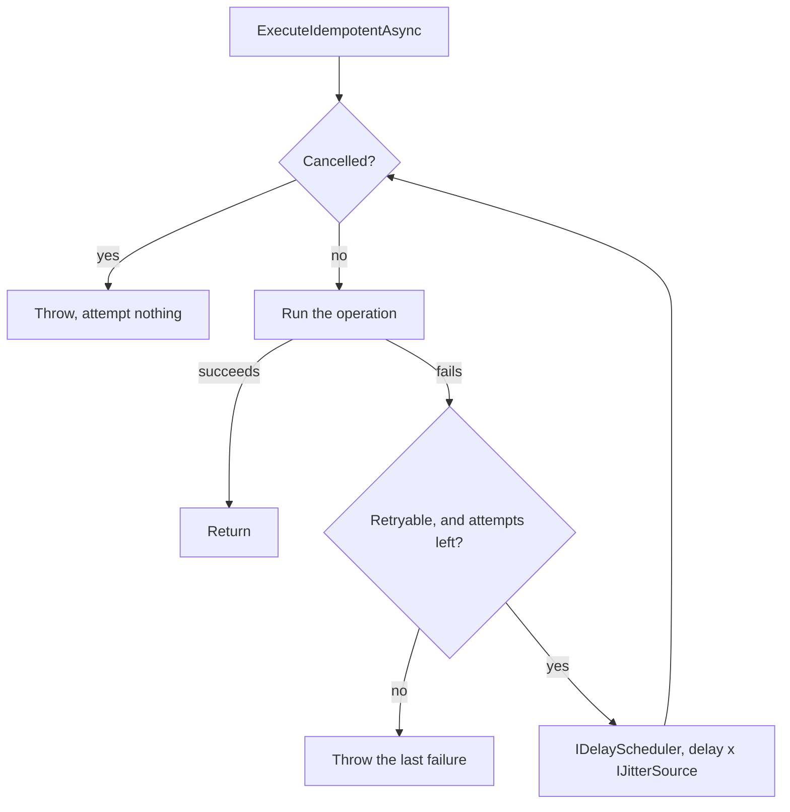

# Retry

**Resilience & Connectivity** — Surviving the failures a networked mobile client actually experiences

## Intent

Try a failed operation again, but only when trying again could work, and only when doing it twice is
safe.

## The problem and context

A mobile client calls a service over a connection that drops, from a device that changes network
mid-request, to a server that is briefly overloaded. Many of those failures succeed on a second
attempt a moment later.

**A retry loop is ten lines. The pattern is everything around it:**

* **which failures are worth retrying** — a 503 may clear, a 400 never will;
* **whether the operation is safe to repeat** — a read is, a payment may not be;
* **how long to wait** — and why every client waiting the same amount is its own problem;
* **when to stop** — including when the user has already left.

## The decision that makes it a pattern

```csharp
public static bool IsTransient(HttpStatusCode status) => status is
    HttpStatusCode.RequestTimeout          // 408
    or HttpStatusCode.TooManyRequests      // 429
    or HttpStatusCode.InternalServerError  // 500
    or HttpStatusCode.BadGateway           // 502
    or HttpStatusCode.ServiceUnavailable   // 503
    or HttpStatusCode.GatewayTimeout;      // 504
```

Everything else — 400, 401, 403, 404, 409 — is **not** retried. The request was wrong, and sending it
three more times spends the user's time, the device's battery and the server's capacity to arrive at
the same answer.

**This is a default the caller may replace, not a law.** `RetryExecutor` takes the predicate as a
parameter, and three common cases need a different one:

| Status | Why the default is not the whole story |
|---|---|
| **401** | Retryable **after refreshing a token**. That is authentication's business, not a blanket rule |
| **409** | May be retryable **after re-reading** whatever conflicted |
| **429** | Retryable **only when the server's `Retry-After` is honoured** — a different delay from this policy's |

## Idempotency, and where the warning lives

```csharp
await executor.ExecuteIdempotentAsync(operation, TransientFailure.IsTransient, token);
```

**The precondition is in the method name on purpose.** Retrying a read is safe. Retrying a write may
happen twice: an attempt whose response was lost may well have succeeded, so a payment, an order or
a message can be duplicated by the retry that was meant to rescue it.

**Nothing checks this.** The name is not enforcement — it puts the claim in the caller's own code and
in every review of that code, which a warning in a README is not. A caller who ignores a method name
would have ignored a comment too, and at least the name is where they are looking.

## Why the delay never follows the last attempt

The naive loop is `for each attempt { try; catch { delay } }`, and it **delays after the final
failure as well** — the user waits out a full backoff and then gets the exception anyway. With four
attempts and a two-second cap that is seconds of a spinner buying nothing.

The delay here happens only when another attempt will follow.

**The attempt count cannot tell the two apart**, which is why the tests assert the **delay count** as
well: three attempts means two delays.

## Why jitter is not decoration

```
delay(attempt) = min(baseDelay × 2^(attempt-1), maxDelay) × jitter
```

Exponential backoff alone is worse than it looks. Every client that failed at the same moment — a
service restart, a network blip — computes the **same** schedule, comes back together, and fails
together. The backoff has synchronised them into a retry storm.

Jitter spreads them out. This is full jitter: the delay is a random fraction of the capped
exponential value.

**A jitter of zero is legal and produces an immediate retry.** That is the algorithm, not an
accident, and there is a test asserting it so nobody discovers it by having a retry land in the same
millisecond as the failure.

Both the delay and the jitter are **injected**, which is what makes the schedule assertable: a test
supplies a recording scheduler that returns immediately and a fixed jitter. **No test in this pattern
waits on real time.**

## What this is not

**This is not a circuit breaker.** `RetryExecutor` holds a policy, a scheduler and a jitter source,
and **no failure counter, no history and no open, closed or half-open state**. Nothing survives a
call.

Remembering that a service is failing, and declining to call it for a while, is
**Circuit Breaker** — the next entry in this catalogue. The two meet where a retry that keeps failing
is what eventually opens a breaker, and that is where this entry stops.

[Accessing Remote Data (REST)](../RemoteData/README.md) makes exactly one attempt and says so in its
failure messages, naming this entry. This is the other half of that promise.

## Architecture and components



**Participants.**

| Participant | Project | Role |
|---|---|---|
| `RetryExecutor` | `Retry.Core` | The loop, and nothing that outlives it |
| `RetryPolicy` | `Retry.Core` | Attempts, base delay, cap, and the backoff calculation |
| `TransientFailure` | `Retry.Core` | The default classification |
| `IDelayScheduler`, `IJitterSource` | `Retry.Core` | Injected, so tests never wait and schedules are exact |
| `FlakyOperationViewModel` | `Retry.Core` | Shows each attempt, because a retry is invisible when it works |
| `TaskDelayScheduler`, `RandomJitter` | `Retry.Demo` | The real ones |

**Dependencies.** `.Core` depends only on `CommunityToolkit.Mvvm`. This pattern adds no package.

**Polly is what an application would use.** It provides this and far more — circuit breakers,
timeouts, bulkheads, hedging, and a pipeline that composes them — and it is a package this repository
does not carry, because adding one changes shared configuration for every project here. Implemented
directly so the decisions stay visible; in production, reach for Polly.

## When to apply it

* The failure is transient, and a second attempt a moment later could succeed.
* The operation is safe to perform more than once.
* The caller can afford to wait — a background refresh can, a button the user is watching often
  cannot.

## When not to — over-application

**Do not retry a failure that cannot succeed.** This is the defect a retry loop most often ships
with, and it converts a fast error into a slow one.

**Do not retry a write without knowing it is idempotent.** If the server does not deduplicate, a
retry can charge twice. Give the operation an idempotency key, or do not retry it.

**Do not retry inside every layer.** Three layers each retrying three times is twenty-seven attempts
and a very confused user. Retry at one level, and let the others report.

**Do not use a long backoff in front of a waiting user.** Four attempts with a three-second cap is
most of a minute. A background sync can afford that; a tapped button cannot.

**Do not omit jitter because the schedule looks tidier without it.** Tidy is the problem.

## Production-readiness considerations

**Testability** — proven directly. The delay and the jitter are dependencies, so the schedule is
asserted exactly and **no test sleeps**.

**Cancellation** — the token is checked before **every** attempt, including the first: a caller that
has already gone does not want the work started, never mind repeated. A cancellation raised by the
operation itself is never treated as a retryable failure, which would otherwise retry the thing the
caller just stopped. The cancellation test lands its cancellation **from inside the scheduler**, so
it controls exactly when and needs no real time.

**No shared state** — see above. This is checkable in review rather than a matter of intent.

**What was actually verified.** All behaviour is exercised in `Retry.Core` with injected time. **No
network is reached**; the demonstration's outcomes are decided in its composition root. It compiles
for all four platform heads and has not been run on a device.

## Trade-offs

**What it buys.** A transient failure stops being an error the user sees. The policy is one object,
stated once, and the classification is a parameter rather than a buried `if`.

**What it costs.** Every retry multiplies load on a service that may already be struggling — which is
precisely why Circuit Breaker exists. Latency becomes harder to reason about, because a slow call may
be one attempt or four. And the idempotency precondition is a promise the compiler cannot keep.

## Relationships

Sits directly after **Accessing Remote Data (REST)**, which makes one attempt and names this entry,
and directly before **Circuit Breaker**, which this entry deliberately does not implement. Uses
**Dependency Injection** for the scheduler and jitter, and **Model-View-ViewModel** for the screen.

Conceptually the **Retry** pattern from the cloud design patterns catalogue, and it composes with
**Circuit Breaker** there in the same way. Described in prose only; this repository holds no
reference to `csharp-project-002-cloud-design-patterns`.

## What the tests assert

`Retry.Core.Tests` asserts that a successful operation is attempted once with no delay; that a
transient failure then success is two attempts and **one** delay; that three failing attempts produce
**two** delays and rethrow the last failure; that **a non-retryable failure is attempted once and
rethrown immediately**; that delays grow exponentially and are capped; that jitter scales them, that
zero jitter retries immediately, and that two jitter sources give different schedules; that
cancelling during a delay stops early with fewer attempts than allowed; that an already-cancelled
caller never enters the operation; and that a cancellation raised by the operation is not retried.

`TransientFailure` is tested against six retryable and five non-retryable status codes, and
`FlakyOperationViewModel` against recovery, immediate refusal, exhaustion and being run twice.

The retryable predicate was ignored, so every failure was retried. **Exactly one test failed** — the
non-retryable one — and it was restored.
