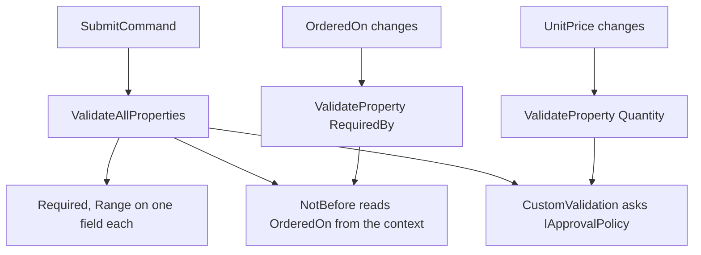

# Validation

**Presentation & MVVM** — Structuring the view layer so it is testable, declarative and decoupled from platform UI

## Intent

Express every rule a form must satisfy as an attribute the framework can run, including the rules
that involve more than one field.

## The problem and context

A purchase requisition has four fields and five rules. Three are about one field each:

* a requester is required;
* a quantity is between 1 and 1000;
* a unit price is above zero.

Two are not, and they are the reason this pattern exists:

* **the required-by date must not precede the order date** — a rule about two fields;
* **the total must be within the requester's approval limit** — a rule that needs a limit the view
  model cannot know, because it depends on who is asking.

An attribute placed on a single property cannot see another property, and cannot see a service.

**This entry does not repeat [Model-View-ViewModel](../Mvvm/README.md).** That pattern already shows
`ObservableValidator` with a `[Required]` field, a command gated on `HasErrors`, and an error
surfaced for binding. **That is the mechanism.** This entry is about the rules the mechanism cannot
express on its own, and about when validation should run.

## The idiomatic approach

**A reusable attribute, for a rule about two properties.** It reads the other property from the
validation context:

```csharp
protected override ValidationResult? IsValid(object? value, ValidationContext validationContext)
{
    var other = validationContext.ObjectInstance
        .GetType()
        .GetProperty(OtherPropertyName)
        ?.GetValue(validationContext.ObjectInstance);
    ...
}
```

**A `[CustomValidation]` method, for a rule that needs a service.** It recovers the view model from
the same context, and through it the injected policy:

```csharp
public static ValidationResult? ValidateWithinApprovalLimit(int quantity, ValidationContext context)
{
    var instance = (PurchaseRequisitionViewModel)context.ObjectInstance;
    var limit = instance._approvalPolicy.LimitFor(instance.RequestedBy);
    ...
}
```

**Every rule is an attribute, and that is a constraint rather than a style.**
`ValidateAllProperties` runs the validation of public instance properties "provided they have at
least one `[ValidationAttribute]` applied to them". A rule written as a hand-rolled check inside the
submit command would be **invisible** to it, and the submit path would accept a form it should
reject.

## The problem that makes this pattern worth its own entry

**A cross-property rule goes stale.** `RequiredBy` is validated when `RequiredBy` changes. If
`OrderedOn` moves instead, nothing re-runs that rule, and the old verdict simply stays — a form that
reads as valid and is not.

Microsoft's documentation says so directly, adding a call "in the setter for `B`, so that `A` is
validated again whenever `B` changes (since its validation status depends on it)".

This repository uses the `[ObservableProperty]` source generator, so there is no setter to edit. The
generated `OnXxxChanged` hook is the equivalent place:

```csharp
partial void OnUnitPriceChanged(decimal value)
{
    ValidateProperty(Quantity, nameof(Quantity));
    ...
}
```

**Both calls were removed in turn and the tests re-run**, to confirm the tests that claim to prove
them can fail without them. Removing the `UnitPrice` call failed two tests of seventeen; removing
the `OrderedOn` call failed one. Every other test passed either way, which is the point: a rule that
went stale would not have been noticed by anything else.

## Two things the documentation and the shipped assembly disagree about

**`ClearAllErrors` is documented and not callable.** Microsoft states that `ObservableValidator`
"exposes a `ClearAllErrors` method". In **CommunityToolkit.Mvvm 8.4.2** that method is `private`,
and calling it from a derived class fails with `CS0103`. Established by reflecting over the shipped
assembly after the build refused it. The member that exists is **`ClearErrors`**, whose property
name is optional and which clears everything when omitted.

**`[NotifyDataErrorInfo]` requires a validation attribute on the same member.** `OrderedOn` carries
none — it is the date `RequiredBy` is measured against, not a validated field itself — and pairing
the two produces `MVVMTK0026`. The generator is right to refuse: the pair would claim a validation
that does not exist.

## Money in a `[Range]` is wrong twice if written the familiar way

```csharp
[Range(typeof(decimal), "0.01", "1000000", ParseLimitsInInvariantCulture = true)]
```

| Written as | What happens |
|---|---|
| `[Range(0.01, 1000000)]` | The constructor takes **doubles**, converting away the precision `decimal` was chosen for |
| `[Range(typeof(decimal), "0.01", "1000000")]` | The limits are parsed **in the current culture**, so `"0.01"` is not one hundredth where the separator is a comma |
| The form above | Correct on every machine |

The second is the dangerous one: this repository's `NeutralLanguage` is `en-GB`, so the defect
would never appear here and would appear immediately for a contributor elsewhere. A test sets the
thread culture to `de-DE` and asserts the limit still holds.

## Architecture and components



**Participants.**

| Participant | Project | Role |
|---|---|---|
| `PurchaseRequisitionViewModel` | `Validation.Core` | The form, and where the rules are declared |
| `NotBeforeAttribute` | `Validation.Core` | A reusable rule about two dates |
| `IApprovalPolicy` | `Validation.Core` | The limit the view model cannot know |
| `SubmittedRequisition` | `Validation.Core` | What a successful submission produces |
| `MainPage` | `Validation.Demo` | The form, and the `DateOnly` to `DateTime` adapter |

**Dependencies.** `.Core` depends only on `CommunityToolkit.Mvvm`. This pattern adds no package.

**`NotBeforeAttribute` is applied once in this repository.** Its documented advantage over a
`[CustomValidation]` method is reuse, and one use does not demonstrate reuse. It is written as an
attribute because the rule says nothing about requisitions and would suit any pair of dates — the
benefit is available rather than shown.

## When to apply it

* A form has a rule spanning more than one field.
* A rule depends on something only a service knows.
* The same rule belongs on several forms.

## When not to — over-application

**Do not validate in the constructor.** A form that opens red has told the user they are wrong
before they have done anything. This form validates on change and on submit, and shows nothing
until one of those happens.

**Do not gate submission on `CanExecute` alone.** On a pristine form `HasErrors` is false because
nothing has been validated. That is "no known errors", not "valid", and binding a button to the
first while meaning the second enables it on an empty form. `SubmitCommand` validates, then decides.

**Do not reach for a custom attribute when a method will do.** `[CustomValidation]` is less
ceremony and keeps the rule beside the thing it governs. Prefer an attribute when the rule is
genuinely general.

**Do not put a rule anywhere `ValidateAllProperties` cannot see it.** A check inside a command looks
like validation, runs only on that path, and is silently skipped by every other one.

## Production-readiness considerations

**Testability** — proven directly. Every rule is exercised without a platform, including the two
cross-property rules and the injected policy.

**Hostile input** — `NotBeforeAttribute` is given a value that is not a date, a reference to a
property that is not a date, and a reference to a property that does not exist. Each returns success
rather than throwing: a misnamed reference is a programming error, and failing validation would
report it to the user as a mistake on a form they cannot fix.

**A blank requester** — `LimitFor` is called while `RequestedBy` may still be empty, because
`Quantity` is validated independently. The contract says it must return a limit for any input. A
validation rule that throws takes the form down instead of reporting a problem.

**What was actually verified.** The demonstration compiles for all four platform heads — Android,
iOS, Mac Catalyst and Windows — and has **not** been run on a device or an emulator. Every
behavioural claim here rests on `Validation.Core` and its tests.

## Trade-offs

**What it buys.** Rules are declarative, discoverable on the property they govern, and run by one
call that cannot forget one.

**What it costs.** Cross-property rules need a re-validation call that nothing enforces — the
compiler does not know that `Quantity`'s verdict depends on `UnitPrice`, so the only thing standing
between a correct form and a stale one is a test. Attribute rules are also awkward to express when
they are conditional, and reflection in a custom attribute is not free on a hot path.

## Relationships

Extends **Model-View-ViewModel**, which introduces `ObservableValidator`; this entry covers the
rules that outgrow a single attribute. Uses **Commanding and Behaviours** for submit and reset. A
form that fails validation often needs to tell another part of the application, which is
**Loosely-Coupled Messaging**, and a form that refuses to submit often needs to stop the user
leaving, which is **Navigation**.

Conceptually the **Specification** pattern, and the **Decorator** pattern from the Gang of Four
catalogue — each attribute is an independent rule composed onto a property. Described in prose only;
this repository holds no reference to `csharp-project-001-gof-design-patterns`.

## What the tests assert

`Validation.Core.Tests` asserts that an untouched form reports nothing; that a complete requisition
submits and carries every field; that a blank one does not submit and says why; that quantity,
price and date rules report their own messages; that moving the order date past the required date
puts the required date into error; that raising the unit price past the approval limit puts quantity
into error and lowering it clears that error; that reset clears both fields and errors; that the
error summary lists every current error rather than the first; and that the monetary limits hold
under a culture whose decimal separator is a comma.

`NotBeforeAttribute` is tested on its own, including the three inputs that must not throw.
